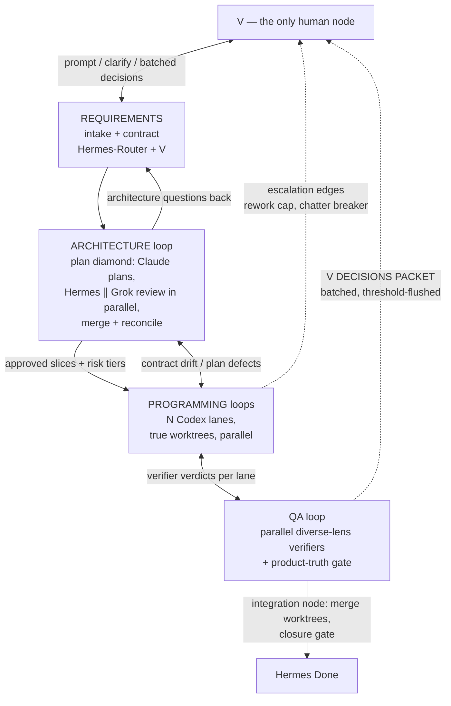

# DebateAI Graph Harness Blueprint v0.2

> **For agentic workers:** This is a protocol-change plan, not a code plan. Execute phase-by-phase with Hermes review between phases per team law ("no code without plans" — this IS the plan; V approves before any phase executes). Steps use checkbox syntax for tracking.

**Author:** Claude (Fable), 2026-07-23. v0.1: 11-agent graph audit. v0.2: +8 agents (adversarial Lite-vs-Full decision panel + total protocol sweep: full-body deep read, complete instance inventory, contradiction hunt, master law extraction). §6 records the single-winner decision V requested.
**Goal:** Restructure the Heartbeat protocol family into a real graph — Node / Edge / Router / State pillars, diamond topology, true worktrees, verifiers on edges, guaranteed cycle convergence, batched V approvals — while preserving every battle-tested safety law.
**Recommendation (the "new harness vs improve" question):** **Neither a brand-new harness nor in-place patching. Write one new Graph Spine document as the single source of truth and shrink every existing Heartbeat instance into a thin node contract that references it.** Rationale in §1.4.

---

## 1. Audit verdict

### 1.1 Scorecard against the 8 graph requirements

| # | Requirement | Verdict | Core evidence |
|---|---|---|---|
| 1 | Node: bounded job, no graph knowledge | **VIOLATED (structural)** | Launch packets hand a 2-file-scoped worker the full 15-ticket route + sibling missions (BOARD-CLOSURE-EPOCH-3 packet); every agent must read spine+adapter+skill+full comment history at every boundary; Codex boot step 4 = "List Kanban for the active tenant" (board-wide) |
| 2 | Edge: data-flow, not "and then" | **VIOLATED (structural)** | H2→G3 and H4→G5 gates serialize reviews that consume only the upstream artifact, not each other's verdicts (verified: G3 reads Plan.md, never H2's verdict). Status-as-message is a documented pitfall — edges don't reliably signal |
| 3 | Router: dispatches, does no work | **VIOLATED (structural)** | Hermes = "cockpit broker, status/comment router, evidence gate, human-review coordinator, and sole Done/Blocked authority" (spine L111) — a god-node. In Lite, V is literally the transport ("V is the transport, not the analyst", ~10-12 manual hops per mission). Exception: the 1-minute watcher IS a correct pure router |
| 4 | State: declared dict, reads/writes per node | **VIOLATED (structural, with nuance)** | ≥8 parallel state carriers: Kanban status, comment-marker FSM, comment cursors, AUTHORITY EPOCH, compaction checkpoints, watcher fingerprints, .hermes/live files, host task list. `blocked` has 11 documented real-world meanings. *Nuance (verifier):* comment templates DO have named fields — the gap is they live in free-text comment bodies parsed by LLMs, not queryable fields |
| 5 | Diamond: split → parallel → merge | **MOSTLY ABSENT** | 14-stage linear chain H0→…→H9 with a gate per hop; review ladder is a homogeneous serial double-gate. Two real diamonds already exist: failed-test ticket fanout, and sibling-lanes+closure-gate — both buried, neither the default |
| 6 | True worktrees | **PAPER ONLY** | Parallelism law = file contracts in a shared tree; "worktree" is a metadata field, not a mechanism. Real worktree procedure exists only in Hermes's planning skill (never in worker adapters; zero occurrences in Claude/Grok adapters). Field-proven once (.worktrees/obs-pr1, obs-pr2). Launch packets force-serialize acknowledged-independent tickets ("LIP-01 and LIP-02 are logical siblings… execute them serially") |
| 7 | Verifier on edge, adversarial | **HALF MET** | Independent review is the system's strongest law (no self-Done, reviewer can't edit, model-family diversity preferred, product-truth gate has real teeth — TS-T8). But verifiers are serial re-checks of the same dimension, never parallel diverse lenses, and default reviewer prompts are neutral, not adversarial. The parallel-3-reviewer pattern already exists in the org's `simplify-code` skill — just never wired into Heartbeat |
| 8 | Cycle convergence + batched approvals | **VIOLATED (structural) — root cause of the void-polling** | No rework-round cap anywhere; `unblock` resets `consecutive_failures` with no ceiling; the wake gate excludes only the watcher's own comments, so every Hermes↔GPT reply is a "meaningful change" that re-wakes the router forever; liveness escalation fires only on SILENCE, never on unproductive back-and-forth; and the "One-Prompt-at-a-Time Relay Law" ("Do not flood V with prompts") plus per-node `HERMES AUTHORIZED NEXT` are explicit anti-batching laws |

### 1.2 The void-polling failure, mechanically explained

Four documented mechanisms compose into the exact failure V had to manually steer out of:

1. Codex posts a handoff and is instructed to park and poll: "After a handoff, do not end the standing goal merely because Hermes review is pending… check Kanban on the internal heartbeat" (CONTINUE-LIP-EPOCH-2 packet L60).
2. Hermes's wake gate treats every non-watcher comment as decision-relevant, so each side's replies re-wake the other (Lite SKILL.md L437 — citation corrected by verification pass).
3. The only escalation trigger is silence (liveness state machine); a card where both sides keep posting non-resolving comments never trips it.
4. When a cap IS hit, the prescribed recovery is `unblock` → reset counter → resume, unboundedly; and the stated fallback of the GPT-side fingerprint dedup is "a manual relaunch" — i.e., V.

The protocol's own docs even name the symptom ("Hermes doing too many short wait → poll → tail log → wait → poll loops", codex-launch-timeout-control.md) but prescribe turn-budget hygiene, not a structural bound.

### 1.3 What already exists and must be PRESERVED (do not re-invent, do not dilute)

1. Independent review before Done; reviewer never edits; worker never self-sends to Hermes; no self-Done.
2. No-fake-data / no-scaffold / RED→GREEN evidence law; "workflow evidence is not product evidence."
3. Per-ticket file contracts (Allowed / Read-only / Forbidden / Verification) — this IS a node contract; keep and extend.
4. Sticky worker/session ownership on rework + `WORKER CONTINUITY OVERRIDE`.
5. AUTHORITY EPOCH monotonic authority + compare-before-write / fresh-read-before-mutate.
6. Blocker-type taxonomy (already an enum in the BLOCKED template).
7. `wakeAgent:false` tokenless change gate (correct and keep — extend its fingerprint spec, §3.4).
8. Detector/reviewer/router separation of powers (already written for the watcher — generalize to Hermes itself).
9. Escalate-to-V-only-for-named-categories filter (provider spend, data writes, deletion, destructive git, architecture/scope, reconstructed evidence, waiver, final acceptance).
10. Product-truth gates requiring live app/API/DB/browser evidence.
11. Failed-test ticket fanout (a real diamond — becomes the template).
12. Sibling-lanes + one-closure-gate pattern; per-worktree Split→Verify→Merge checklist (promote from planning skill to spine).
13. Proportional review fast path low/medium/high (make it a persisted field, §3.3).
14. Human-block circuit breaker freeze rule (generalize its trigger, §3.4).
15. H1 research handoff-integrity-only gate (proof the team already knows how to right-size a gate).
16. **TDD law (added 2026-07-24 after V's preservation check):** mandatory RED→GREEN→REFACTOR — failing test first, smallest green change, refactor under green, RED/GREEN evidence in every handoff; explicit V/Hermes waiver is the only escape and is never itself evidence; tests-after theater without RED evidence is a violation.
17. **DDD law (added 2026-07-24 after V's preservation check):** all work uses the product's domain language and preserves bounded-context/invariant ownership; plans state DDD impact (contexts, terms, invariants) and the ARCHITECTURE loop's plan review verifies it; implementation never crosses bounded-context ownership outside its ticket contract.
18. **Worker-persistence law (added 2026-07-24):** ordinary reversible implementation problems belong to the worker — root-cause investigation and up to three evidence-based non-destructive approaches before blocking; local friction is not a goal blocker.

### 1.4 Why "new spine, same organs" instead of new harness or in-place patches

- **Against a brand-new harness:** §1.3 is ~15 hard-won laws paid for in incidents. A greenfield harness re-learns them at production cost, and the team already runs three overlapping state machines (Kanban, Heartbeat, Zenith) — a fourth is the disease, not the cure.
- **Against in-place patching:** the corpus is already sedimented — Lite SKILL.md 874 lines + 29 refs; full skill 989 lines + 106 refs of which ~45 are dated incident postmortems from a single week and >80% are single-incident narratives; two documents BOTH claim to be the binding review law and contradict each other (peer-review-first vs Hermes-direct-triage) with no supersession rule. The protocol's own reference names this "cockpit rot." Patching rot produces rot.
- **Therefore:** one new `debateai-graph-spine.md` becomes the single normative document (graph = nodes, edges, state schema, routers, convergence laws). Every existing instance — shared spine, 4 adapters, Codex skill, Claude skill, Grok skill, Hermes Lite, Hermes full — is reduced to a thin per-agent node contract that cites the spine. The old spine and skills are not deleted; they are demoted to implementation notes and their incident references archived into a tiered index.

---

## 2. Target graph (V's 0.1, formalized)



Key properties, mapped to the drawing:

- **THE ONE-PROMPT MACHINE LAW (V ruling, 2026-07-24 — inherited from the full protocol, cemented as spine law).** A mission starts with exactly **one V prompt** at REQUIREMENTS (H0); from that moment the machine runs itself — V never relays prompts, output, or Resume presses. Thereafter exactly three V-facing surfaces exist: **(a) design questions** — `V STEERING REQUIRED` questions may be emitted **only by the REQUIREMENTS and ARCHITECTURE nodes** (H0 intake and the planning diamond C2/H2/G3/H3/C4), during design, exactly as the 0.1 drawing's user↔requirements and architecture→user edges specify; **(b) important-operation decisions** — from ANY node, decisions on the IMPORTANT OPERATIONS list (database deletion, data manipulation, security/auth, provider spend, destructive git/filesystem, architecture/scope expansion, reconstructed evidence, final acceptance) route to V via the batched `V DECISIONS PACKET`; **(c) final acceptance** (H9). No other node may address V, ever.
- **V prompts exactly one node** (REQUIREMENTS). Everything else reaches V only through the three surfaces above. The Lite "V is the transport" relay dies with the stronger machine (full-mode Hermes-managed PTYs already solve this — it's a documented mode switch, not new invention).
- **ARCH↔PROG and PROG↔QA are concurrent inner loops**: while lane A is in QA, lane B is programming, and ARCH can be reviewing the next slice — no global barrier except the integration/closure gate.
- **Every cycle in the picture carries a convergence bound and an escalation edge** (§3.4). No cycle may exist without one — that is a spine-level invariant, not a per-loop patch.

---

## 3. Design

### 3.1 State: one typed ticket-state object (Pillar 4)

Single canonical state block per ticket. If Kanban cannot add native fields, it is written as the FIRST comment and updated by replacement (machine-parseable, one location), never smeared across the thread. All other carriers (live files, task lists) become read-only projections regenerated from it.

```yaml
state:
  ticket: <id>
  risk_tier: low | medium | high            # set ONCE at intake/H6; drives routing deterministically
  status: queued | ready | working
        | waiting_review | waiting_hermes | waiting_product_proof
        | waiting_human | waiting_dependency | waiting_resource
        | failed_tooling | changes_requested | done | archived   # kills the 11-meaning 'blocked'
  owner: { agent: codex|claude|grok, session: <id> }
  contract:                                  # the existing file contract, unchanged
    allowed: [...]
    readonly: [...]
    forbidden: all_others
    verification: [...]
    human_review: yes|no
  worktree: { path: <.worktrees/lane-x>, branch: <b>, merge_status: none|pending|merged }
  authority_epoch: <int>                     # existing mechanism, now a field
  rework_round: <int>                        # NEW — convergence counter
  wakes_since_transition: <int>              # NEW — chatter counter
  waiting_since: <timestamp>                 # NEW — every waiting_* state carries it
  escalation_target: hermes | v_packet       # NEW — every waiting_* state carries it
  comments_read_through: <cursor>            # existing, now a field
```

Node reads/writes are declared in each node contract (§3.6): e.g. *Codex-worker reads {contract, status, rework_round, authority_epoch}, writes {status, worktree, evidence refs}; never writes risk_tier or authority_epoch.*

### 3.2 Router: split the god-node (Pillar 3)

Hermes keeps its authority but is split into two named functions with separate invocations, so dispatch latency is never coupled to review latency:

- **Hermes-Router** — reads typed state only; picks the next edge; writes only routing metadata (assignment, status, epoch). Explicitly forbidden from content judgment — the same "may report/dispatch but may not do work" constraint already written for the watcher, now applied to the cockpit.
- **Hermes-Verifier** — performs stage/ticket evidence review; writes a verdict field. Consumed by the Router; the Router never re-performs verification.

Routing becomes deterministic-on-classified-state: `risk_tier` (persisted, set once) selects the review path mechanically — low → direct Hermes-Verifier diff review + same-cycle Done; medium → one independent reviewer + Hermes-Verifier; high → full diamond (§3.5) + product truth + V. The existing Proportional Review Fast Path text becomes the routing table instead of a buried judgment note.

### 3.3 Node: bounded launch packets (Pillar 1)

Launch packet contents are capped to: the ticket-state block, the immediate upstream artifact path(s), the handoff marker to emit, and the stop conditions. Explicitly removed: full mission routes, sibling-mission references, "do not touch these 6 unrelated tickets" negative space, and pipeline role maps. Route topology lives ONLY in Kanban + Hermes-Router. Codex boot step "List Kanban for the active tenant" is replaced by "fetch your assigned ticket."

### 3.4 Cycle convergence + batched approvals (Pillar 8 — fixes the void-polling)

Spine-level invariant: **no cycle without a bound; no wait without an owner, a deadline, and an escalation edge.** Concretely:

1. **Rework cap:** `rework_round` increments on every CHANGES REQUESTED of any kind (peer, Hermes, stage, human). At `rework_round = 3` the loop freezes and emits into the V DECISIONS PACKET. No more unbounded revise→re-review.
2. **Reset ceiling:** `unblock`/counter-reset may occur at most twice per ticket; the third occurrence freezes + escalates. (Today: unbounded by design.)
3. **Chatter breaker:** generalize the existing human-block circuit breaker — any two-party exchange (Hermes↔worker, Hermes↔watcher) producing **6 comment exchanges or 24 router wakes on one card with no status/epoch transition** trips freeze + escalation. This is the law that would have caught the Hermes↔GPT void loop.
4. **Wake-gate fingerprint fix:** classify comments as *state-changing* (status/epoch/handoff-marker transitions) vs *chatter*; only state-changing comments wake the router. `wakes_since_transition` implements the counter. (Extends change-driven-cron-wake-gate.md; the mechanism is already deterministic — this is a fingerprint-spec change, not new machinery.)
5. **V DECISIONS PACKET:** Hermes accumulates V-owned gates (the existing named-category filter decides *what* qualifies — keep it) and flushes as ONE consolidated packet when: ≥3 decisions pending, OR any decision pending >4h, OR an entire lane is frozen on it, OR V asks. Each row: card, decision needed, evidence link, smallest yes/no. This replaces the One-Prompt-at-a-Time Relay Law for decisions. *(Honest note from verification: "Authorize exactly one current card" is internal dispatch sequencing, not V-facing; the true anti-batching laws being repealed are "Do not flood V with prompts for all future stages" + per-node re-authorization.)*
6. **Batch route authorization:** when a DAG was already approved at H6, Hermes issues one `HERMES AUTHORIZED ROUTE: <ticket list> epoch=<n>` for the chain. Per-node `HERMES AUTHORIZED NEXT` is required again only on a new risk signal (RED, contract drift, architecture boundary, important operation). Precedent already in-corpus: product-truth-gate-after-codex-wave.md batches a whole wave's closure report to V.

### 3.5 Diamonds (Pillar 5) and verifiers on edges (Pillar 7)

1. **Planning diamond (verified safe):** C2 Plan.md → **{H2 Hermes review ∥ G3 Grok review} in parallel** → H3 merge/reconcile (adjudicates disagreements only). Both consume only Plan.md — the audit verified G3 never reads H2's verdict. Same restructure where data allows downstream; H5/H6 stay serial barriers (they genuinely need the whole set).
2. **Planning risk tiers:** Tier 0 (docs/mechanical): Plan → H6 direct. Tier 1 (routine feature): Plan + parallel review diamond, FinalPlan+Slices merged into one hop. Tier 2 (architecture/high-risk): full chain. (The audit brief itself concedes the full chain "may be excessive for routine features.")
3. **Review diamond replaces the double-gate:** for medium/high tickets, fan out 2-3 reviewers with distinct lenses — correctness/tests, security/data-safety, product-truth — in parallel from READY FOR PEER REVIEW; Hermes-Verifier merges, re-checking only disagreements instead of re-verifying everything. Adversarial framing ("actively try to break/refute this work; if unsure, fail it") becomes the DEFAULT reviewer prompt — it already exists in-corpus for high-risk cards and in `simplify-code`'s parallel-3-reviewer pattern; this is wiring, not invention.
4. **Feedback edges that don't exist today:** an explicit architecture→requirements return edge (plan review may reopen intake with a bounded question) and QA→architecture edge (verifier findings that are plan defects route to ARCH, not to a Codex rework loop). Both routed by Hermes-Router on typed findings, both counted by the rework cap.

### 3.6 True worktrees (Pillar 6)

1. Promote the Split→Verify→Merge worktree checklist from `kanban-project-planning` into the Graph Spine as the universal lane mechanism; every implementation lane gets `worktree: {path, branch, merge_status}` state. Claude/Grok node contracts get the same section (today: zero occurrences).
2. **Separate topology from resources:** sibling tickets with non-overlapping contracts are ALWAYS modeled as parallel lanes; a single parametrized semaphore `max_concurrent_heavy: <n>` (declared once in the spine, referenced by pointer everywhere) schedules heavy commands. Laptop: n=1 (today's behavior). Stronger machine: raise one number — no protocol rewrite. Kills the duplicated "one heavy command" prose in ≥4 documents and the hard-coded serialization of acknowledged-independent tickets.
3. **Integration node:** worktree merge is a real graph node with an owner (Hermes-Router assigns), a conflict procedure, and evidence. The ddd-worktree lesson becomes a mandatory closure-gate checklist line: `[ ] git worktree list run; all approved commits confirmed integrated into closure target` (today it is an advisory pointer that was nearly missed in production, and is absent from the full skill's own References list).
4. Glossary: "worktree" = isolated `git worktree add` directory. The generic dirty working tree is called "workdir." (The corpus currently uses one word for both.)

---

## 4. Migration plan

Ordered by pain: convergence first (it is the active bleeding), structure after.

### Phase 1 — Stop the void-polling (small, immediate, no restructure)
**Files:** `docs/agent-protocols/debateai-heartbeat-protocol.md`, `codex-heartbeat-adapter.md`, Hermes `heartbeat-protocol-lite/SKILL.md`, launch-packet template.
- [ ] Add `REWORK ROUND: n of 3` to every CHANGES REQUESTED template; at cap, mandatory `V STEERING REQUIRED` into the decisions packet.
- [ ] Add the chatter breaker (6 exchanges / 24 wakes, no transition → freeze + escalate) as a spine law, generalizing the human-block circuit breaker.
- [ ] Amend the wake-gate fingerprint spec: state-changing vs chatter comments; add `wakes_since_transition`.
- [ ] Add the V DECISIONS PACKET format + flush thresholds; carve decisions out of One-Prompt-at-a-Time.
- [ ] Add `HERMES AUTHORIZED ROUTE` batch authorization for H6-approved DAGs.
- [ ] Define `unblock` reset ceiling (2 per ticket).
**Acceptance:** a simulated non-converging rework loop and a simulated Hermes↔worker chatter loop both provably freeze and escalate within bounds; a pre-approved 5-ticket chain runs with a single route authorization.

### Phase 2 — Typed state
**Files:** spine + all adapters + Lite/full skills; Kanban tooling if field support exists.
- [ ] Introduce the §3.1 state block (native fields if possible; canonical first-comment block otherwise).
- [ ] Replace `blocked` with the `waiting_*` vocabulary; map the 11 documented meanings.
- [ ] Persist `risk_tier` at intake/H6; H6 self-audit verifies its existence and that the review path matches it.
- [ ] Declare per-node reads/writes in each adapter.
- [ ] Demote `.hermes/live` files and host task lists to regenerated projections.
**Acceptance:** Hermes-Router can decide every routing action for a sample board by reading state blocks alone — zero full-thread replays; board rendering distinguishes waiting_human from waiting_resource at a glance.

### Phase 3 — Graph Spine v2 + thin node contracts
**Files:** NEW `docs/agent-protocols/debateai-graph-spine.md`; rewrite the 4 adapters + 3 agent skills as node contracts; Lite/full Hermes skills refactored to cite the spine.
- [ ] Author the spine: pillars, state schema, router split (Hermes-Router vs Hermes-Verifier), convergence invariant, preserved laws (§1.3 verbatim), glossary.
- [ ] Reconcile the two contradictory "binding" review documents (peer-review-first vs Hermes-direct-triage) into one diagram with explicit applicability conditions.
- [ ] Bound launch packets per §3.3; replace Codex boot board-listing with assigned-ticket fetch.
- [ ] Tier the 106+29 reference files: reusable procedure vs dated postmortem; archive postmortems under `references/archive/` with an index noting which were generalized.
**Acceptance:** every agent instance ≤150 lines + spine citation; no rule exists in two places; a new agent can be onboarded from spine + its own contract only.

### Phase 4 — Diamonds
**Files:** spine (stage gates), Hermes skills, reviewer prompt templates.
- [ ] H2 ∥ G3 parallel plan review with H3 merge; planning risk tiers 0/1/2.
- [ ] Diverse-lens parallel review diamond for medium/high tickets; adversarial default reviewer prompt; Hermes-Verifier merges disagreements only.
- [ ] Architecture→requirements and QA→architecture feedback edges, rework-cap counted.
- [ ] Independent lightweight H6A check (Claude or Grok reads the Slices→ticket diff) replacing the unaudited self-check for ordinary missions.
**Acceptance:** wall-clock for a Tier-1 mission's planning phase drops ≥30% vs the serial chain on the same content; review disagreements are adjudicated, not re-reviewed.

### Phase 5 — True worktrees (stronger machine)
**Files:** spine worktree section; Claude/Grok adapters; launch packets; semaphore declaration.
- [ ] Per-lane `git worktree` isolation as default for parallel-safe siblings; integration node + mandatory closure-gate worktree check.
- [ ] `max_concurrent_heavy` parameter replaces all duplicated one-heavy-command prose (single declaration, pointers elsewhere).
- [ ] Worktree/workdir glossary.
**Acceptance:** two sibling tickets execute concurrently in isolated worktrees with independent verification and a clean merge on the new machine; laptop behavior unchanged with n=1.

### Phase 6 — Retire V-as-transport
- [ ] On the stronger machine, default missions to full-mode Hermes-managed PTYs (or scripted CLI bridges), keeping Lite only as the degraded-hardware fallback; V's touchpoints reduce to: intake, decisions packets, final acceptance.
**Acceptance:** a Tier-1 mission completes with ≤3 V interactions total.

---

## 5. Non-goals

- No new orchestration runtime, no LangGraph/framework adoption — plain protocol + Kanban + existing tooling (consistent with the team's graph-engineering research verdict: the four pillars are patterns, not a framework purchase).
- Zenith remains the high-risk contract/validator system; this blueprint does not merge or replace it (that is a separate decision — but the state schema in §3.1 is designed so Zenith assertions can reference ticket state without a third state machine).
- No weakening of any §1.3 preserved law. Convergence caps never override safety gates — a frozen loop escalates; it never auto-approves.

## 6. The single-winner decision (v0.2 — answers "improve Lite or improve Full?")

### 6.1 The complete instance map (nothing else exists)

Two independent lineages that do not reference each other, plus one rogue:

**Lineage A — repo spine cluster (v2.2.0, git-controlled, INTERNALLY PERFECT):** `docs/agent-protocols/` spine (506 lines, no version field) + 3 adapters + 3 vendor skills (.claude/.grok live; **.codex and .agents are symlinks pointing OUTSIDE the repo** into a stale `.zenith` project snapshot — not version-controlled) + `apps/dialectical-engine/AGENTS.md` §Shared Agent Protocol. Diffed against the 2026-07-10 skill-dev snapshot and both ts-t1-proof snapshots: **zero drift, zero internal contradictions.** Gap: Hermes has NO repo-local adapter (.hermes/skills/ has 6 skills, no heartbeat-protocol).

**Lineage B — Hermes AppData skills (v1.x, where ALL the rot lives):** `heartbeat-protocol` alias (166 lines, v1.5.2) → `debateai-kanban-heartbeat-review-loop` FULL body (989 lines + 106 refs, 45 of them dated one-week postmortems) ∥ `heartbeat-protocol-lite` (874 lines + 29 refs, v1.2.17 — an independent parallel rewrite, NOT a subset). One one-way bridge reference (`shared-protocol-spine.md` — the design doc that *created* Lineage A). **Hermes operates day-to-day from Lineage B and never consults the repo spine.**

**Rogue:** session-root `debate/.claude/skills/heartbeat-protocol/SKILL.md` (88 lines, unversioned) — a THIRD substrate where Claude itself codes via lane-orchestrator/implementer/verifier subagents, no Codex, no PTYs. Shares the exact skill name; wins name resolution outside `DebateV2/apps/dialectical-engine`. Directly violates the Codex-only coding law every other instance enforces.

**Stale/noise (prune):** `DebateV2-skill-dev-20260710-170226/` (orphaned git worktree of an already-merged branch — `git worktree remove`), `ts-t1-proof/` snapshots (disposable), zenith pytest fixtures (false positives, no heartbeat content).

### 6.2 The decision

**Winner: the FULL operating model on the Lineage A document base.** Precisely:

1. **Operating model: FULL.** Hermes orchestrates everything — launches and holds agent sessions, mutates Kanban directly, directs agents through comments. "V does not paste prompts, relay output, or press Resume" is the target 0.1 graph stated in different words. Panel consensus (Full advocate + incident historian, with the hybrid analyst's mechanism): Lite's failure signature (epoch staleness, reviewer races, void-polling) is the cost of having *no persistent owner* — a constraint the stronger machine removes by construction — while Full's failure signature (PTY ceremony, duplicate Zenith engine, dirty-worktree contamination, cockpit rot) is exactly what this blueprint's typed state, worktrees, and router split remove by name.
2. **Document base: neither Hermes skill.** The repo spine cluster (Lineage A) is the only internally clean, versioned, git-controlled, contradiction-free foundation — and Lineage B's own bridge reference already designates it the intended shared source of truth. Graph Spine v2 (Phase 3) is authored as the evolution of `docs/agent-protocols/debateai-heartbeat-protocol.md`, in place.
3. **Lite: RETIRED as a protocol, transplanted as law.** The Lite advocate's evidence is real — the correctness machinery lives in Lite (authority epochs 12-vs-2 files, wakeAgent gate 5-vs-1, circuit breakers 3-vs-0, proportional review 3-vs-0; zero dated postmortems vs 45) — and the hybrid analyst proved these are universal harness needs, not laptop workarounds (Full's own references independently reinvented crude versions of both the wake gate and epochs; Full's cockpit-rot remediation prescribes exactly Lite's watcher design). Every Lite-only law in §6.4 moves into the Graph Spine as universal law. Constrained hardware becomes a parameter (`max_concurrent_heavy: 1` + relay fallback note), not a second 874-line document.
4. **The FULL body (`debateai-kanban-heartbeat-review-loop`): DEMOTED.** Its unique load-bearing content (worktree split-verify-merge + integrate-before-closure, stage gates, batch-wave re-list, dirty-worktree attribution, architecture-boundary trigger list, live monitoring, Zenith mission mode) merges into the Graph Spine / node contracts; its 106 references get the Phase-3 tiering (≈14–18 reusable procedures kept, ~90 postmortems archived). The Hermes alias becomes a thin loader → repo spine + a new Hermes node contract (Router/Verifier split per §3.2).

### 6.3 Decisions only V can make (blocking §6 execution)

1. **The rogue session-root Claude skill.** It encodes Claude-as-coder with implementer/verifier subagents — the opposite of the "Codex GPT-5.6 Sol = sole coding worker" law. Under one-protocol law it must be retired or explicitly legalized as a mode (e.g. `[Claude]` coding tickets when V changes the model law). Until decided, it silently wins skill resolution for any work outside `DebateV2/apps/dialectical-engine`. **Recommend: retire the file; if Claude-coding lanes are wanted later, add them as a spine-legal mode, not a shadow protocol.**
2. **Worktrees:** FULL obligates them for parallel lanes; Lite gates "branch/worktree operations" as an IMPORTANT OPERATION needing V approval. Blueprint resolution (recommend): worktree *creation/use for isolation* is default-legal per §3.6; *destructive* git operations stay V-gated. Needs V's confirmation since it repeals a Lite law.
3. **Peer review:** universal-mandatory (spine/FULL) vs risk-proportional (Lite). Blueprint resolution (recommend): adopt proportional — as a persisted, auditable `risk_tier` field per §3.3/§3.5, so the exception is visible, never implicit.
4. **Prune approvals:** `git worktree remove` of the merged skill-dev worktree; deletion of ts-t1-proof snapshots (deletion needs V's explicit approval per standing law).

#### 6.3.1 V's rulings (recorded 2026-07-23)

1. **Claude skill — SUPERSEDED-BY-DESIGN.** A new Claude skill will be authored soon with Claude's cemented role inside the application. The session-root rogue file is retired the moment the replacement lands. Until then it is a known shadow instance: do not invoke it; any `[Claude]` routing follows the spine, not the rogue file.
2. **Worktrees — IMPORTANT-OPERATION GATE STANDS (Lite's law wins; provisional).** V rules worktree operations remain V-gated. Blueprint accommodation so this does not re-serialize Phase 5: the gate is satisfied **per-mission, not per-operation** — at H6, Hermes submits the complete lane plan (worktree paths, file contracts, merge order, closure/integration target) as one row in the V DECISIONS PACKET; V's single approval covers every worktree create/use inside that approved plan. Destructive git operations (delete/rewrite/force) always remain individually gated. Marked provisional per V's own phrasing ("if I were to take a guess") — reconfirm at Phase 5 kickoff with wall-clock data from Phase 1–4 missions.
3. **Peer review — RULED: PROPORTIONAL (2026-07-23).** V adopts proportional review with persisted auditable `risk_tier` set at ticketization, an immutable high-risk floor (persistence/migrations, provider spend, security/auth, scoring semantics, live/product data, destructive or architectural work can never be tiered down), H6 self-audit verifying path-matches-tier, and escalation edges (which V explicitly endorses) wired per §3.4. §6.3 is now fully closed pending only the provisional worktree reconfirmation at Phase 5.
4. **Pruning — DEFERRED TO POST-FINAL-PUSH.** Nothing is deleted or archived before the migration's final push. Standing instruction: after the final push, Claude explicitly asks V for prune approval (skill-dev worktree removal, ts-t1-proof disposal, reference-archive moves).

#### 6.3.2 V's rulings (recorded 2026-07-24 — orchestrator architecture, second round)

- **R1 — MAIN ORCHESTRATOR: CLAUDE (FABLE); HERMES KEEPS BOARD CUSTODY AS VERIFIER/QA.** Claude Code (Fable) becomes the Main Orchestrator: launches everything, routes everything, runs the One-Prompt Machine. Hermes re-seats at the programming-orchestration→QA corner: Kanban board custody, Kanban board crafting, Manual QA runs, and independent verification. Rationale (V): separation of concerns, and Hermes is battle-tested at pure code orchestration — its incident-hardened board machinery stays where it's proven. Effect: the §3.2 Router/Verifier split is now assigned across model families — Router=Claude, Verifier=Hermes.
- **R2 — TOKEN BUDGET: DEFERRED.** Out of scope for now; to be scoped in the near future.
- **R3 — ORCHESTRATOR OUTAGE FALLBACK.** If the Claude session is down, the Architecture-responsible agent communicates directly with the humans ("us" = anyone using the harness). Note: ARCHITECTURE already holds design-question authority under the One-Prompt Machine law, so this fallback uses an existing authorized surface — no new exception to the three V-facing surfaces is created.
- **R4 — CODING LAW PARAMETRIZED.** The Codex-only coding law does NOT survive unchanged. Coding-agent identity becomes a configurable **model-law roster** (explicit, versioned config/state — never hard-coded prose). Future coding agents will be specified; the harness treats coding-agent assignment as volatile by design.
- **R5 — MISSION/PILOT FALSIFICATION CRITERIA.** A pilot (and any mission) is falsified by: scaffolded data; fake test runs; test cheating; TDD/DDD violations; anything the agent is specified NOT to do and does; anything the agent is told TO do and does not; **chain-of-command violations** (any agent exercising an authority its seat does not hold, or bypassing a level of the authority lattice); and questions addressed directly to humans by loops that do NOT hold question authority (a One-Prompt Machine violation).
- **R7 — LOOP-OWNERSHIP ELECTION AT INTAKE (2026-07-24).** In the initial prompt that invokes Claude's Main Orchestrator skill, Claude prompts the user to answer which model(s) — one or more — own which loop (REQ/ARCH/PROG/QA). The user answers; Claude then kicks the Heartbeat Protocol off. Answers instantiate the mission's `loop_ownership` map in the model-law roster (R4); part of the H0 design-question surface, so no new V-facing surface. Explicit delegation is legal and recorded.
- **R8 — REPORTING & TRACEABILITY LAW (2026-07-24).** The new harness documents itself like the old one did — reports are mandatory, traceability is non-negotiable. Four duties: (1) ticket trace: no Done without the full durable chain (state block, evidence-bearing markers, verdicts) on the ticket; (2) cockpit receipts after every board-mutation batch; (3) mission reports: the Main Orchestrator writes durable phase reports and a mission closure report to `.hermes/reports/<mission>/`, append-only, and the R6 SATISFIED markers must reference the closure report; (4) loop reports: each of the Four Loops records its convergence counters. Incomplete report chains fail acceptance (ties into R5); fabricated/backfilled reports are evidence violations.
- **R6 — THE FOUR LOOPS / GRAND LOOP LAW.** Every harness part is a loop: REQUIREMENTS ENGINEERING is a loop, ARCHITECTURE is a loop, PROGRAMMING is a loop, QA is a loop. The mission itself is the Grand Loop, and it terminates **only when REQUIREMENTS ENGINEERING and ARCHITECTURE are both satisfied** with how the task went. Each inner loop keeps its own convergence bounds (§3.4); satisfaction flows upward from PROGRAMMING/QA into ARCHITECTURE/REQUIREMENTS; V's final acceptance is exercised through the REQUIREMENTS surface. No loop other than REQ∧ARCH satisfaction closes a mission.

### 6.4 Master transplant list (into Graph Spine v2)

**Universal, zero-contradiction (KEEP AS-IS):** independent review / no-self-Done / reviewer-never-edits; RED→GREEN→REFACTOR evidence with explicit-waiver-only escape; file contracts + one-writer-per-file; sticky session ownership + WORKER CONTINUITY OVERRIDE; product-truth gate + V MANUAL QA PACKET; failed-test ticket fanout diamond; sibling-lanes-by-default + one closure gate; self-blocking prevention ("local friction is not a goal blocker"); same-cycle HERMES DONE handshake; Hermes 4-way same-cycle Triage disposition.

**From Lite (transplant as universal law):** AUTHORITY EPOCH (monotonic, V/cockpit-only); compare-before-write / abort-stale-write; wakeAgent tokenless change gate (FULL's [SILENT] sentinel demoted to fallback tier); edge-triggered GOAL BLOCKED; needs_input/block-loop circuit breaker (parametrized off native-tool specifics); IMPORTANT OPERATIONS enumeration (Lite's precise list replaces the spine's vague sentence); cockpit legibility DONE/RUNNING/BLOCKED/V ACTION format; Kanban visual-launch three-layer receipt; Zenith-principles-vs-runtime as a risk dial (principles-only for ordinary work, real Zenith chamber for high-risk).

**From FULL (transplant into spine/node contracts):** worktree split→verify→merge + **integrate-before-closure as a mandatory checklist line**; numbered-stage gates with non-delegable Hermes review (restructured into the §3.5 diamonds); batch/wave re-list-before-finalizing; dirty-worktree/pre-existing-dirt attribution; architecture-boundary stop-and-route trigger-word list; live-output channel law; main-thread-orchestrator/never-writer subagent law (converges with the rogue skill's identical three-layer structure — one law, two transports).

**Reconcile during Phase 3 (contradictions the merge must resolve explicitly):** Triage-direct vs peer-review-first (state applicability conditions); marker vocabulary union (HERMES DONE/BLOCKED, AUTHORIZED NEXT/ROUTE, EXTERNAL REVIEW added to spine; PEER REVIEW APPROVED kept as separate marker); stage numbering unified on the fuller H0–H9 scheme; watcher cadence self-contradiction in FULL (1-minute mandatory vs 3–5-minute recovery advice) resolved by the wake gate — cadence becomes irrelevant when unchanged ticks are tokenless; Codex worker-self-unblock exception kept only as an explicitly V-toggled capability field in typed state; compaction checkpoints kept for PTY transports, marked N/A for SDK-subagent transports.

### 6.5 Additional migration tasks (append to Phase 3)

- [ ] Add frontmatter version to the repo spine (it has none today); adopt one version scheme across spine + adapters + Hermes loader.
- [ ] Replace the `.codex` and `.agents` skill symlinks with real in-repo files (they currently resolve into an unrelated `.zenith` project snapshot outside version control).
- [ ] Create the missing Hermes repo-local node contract (`.hermes/skills/heartbeat-protocol/` or equivalent) so Hermes loads the same spine as everyone else — ending the two-lineage split that let the contradictions accumulate.
- [ ] Retire/resolve the session-root Claude skill per V's §6.3.1 decision.
- [ ] `git worktree remove` the merged skill-dev worktree; dispose of ts-t1-proof snapshots (after V approval).

## 7. Known corrections from adversarial verification

- The "wake forever" quote lives in `heartbeat-protocol-lite/SKILL.md` L437, not the cron-wake-gate reference (audit citation error; substance confirmed where it lives).
- The spine's comment templates DO define named-field schemas — the state problem is encoding (free-text comment bodies, LLM-parsed, full-history replay), not total absence of structure.
- "Authorize exactly one current card" is internal dispatch sequencing under the resource semaphore, not a V-approval bottleneck; the genuine anti-batching laws are the One-Prompt-at-a-Time Relay Law and per-node `HERMES AUTHORIZED NEXT`.
- One audited launch packet (START-LIP-00) is marked SUSPENDED; its one-at-a-time rule was verified to persist in the currently active packet (BOARD-CLOSURE-EPOCH-3 L64), so the finding stands.
