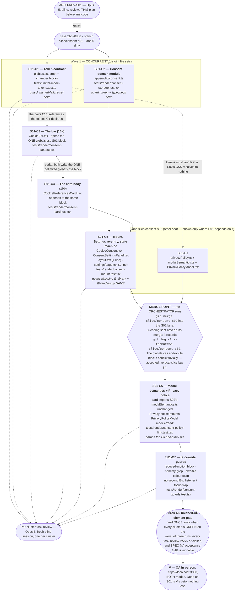

# Mission graph — slice S01 (cookie consent) · ARCH-S01, 2026-09-06 · rework round 1 applied 2026-09-06 (ARCH-S01-REWORK-R1)

**Rework round 1 changed exactly one thing in this file:** the `C2 → C3` edge is removed and `C2 → C5`
is drawn instead, because the clause that justified `C2 → C3` is deleted from `S01-S16` (ARCH-REV-S01
**B3**), and the `C1 → C3` edge is now labelled and also declared in `PLAN.md` §Concurrency, which is the
binding artifact (**N4**). Nothing else moved.

Lane `/Users/vladmihaimiron/Documents/DebateAIRO/dialectical-engine/.worktrees/consent-s01/dialectical-engine`,
branch `slice/consent-s01`, base `2b670d30`. Authority for the steps: `docs/missions/consent-ui/slices/S01/PLAN.md`.

**The planning-graph gate** (spine v3.2.0 item 5) asks for V's yes on this image; per the orchestrator's ruling
recorded as row **V-8**, the fleet proceeds by default and V vetoes. This file is the artifact that ruling covers.

## Cluster graph

## Reading the graph

| Edge | Why it exists |
|---|---|
| `BASE → C1`, `BASE → C2` | Disjoint file sets, so they are the one CONCURRENT pair in the slice. |
| `C1 ⇢ S02-C1` (dashed) | Cross-lane. S02 declares no token and consumes the five S01 declares for it (`COMMON.md` §10.8); until S01's token block is committed, S02's CSS resolves to nothing. |
| `C1 → C3` | The bar's CSS block references `--z-consent-bar` and the other tokens C1 declares; without C1 the declaration does not exist and the bar's layer resolves to `auto`. **This edge is now also declared in `PLAN.md` §Concurrency**, which is the binding artifact (ARCH-REV-S01 N4). |
| **`C2 → C3` — REMOVED, 2026-09-06 (ARCH-REV-S01 B3/N4).** | Its justification here was "its buttons call the codec C2 exports" — the wiring clause `S01-S16` carried, which the rework DELETES because it had no file, no acceptance and no lawful home in C3 (the behaviour is `S01-S29`'s, in C5). Measured: `CookieBar.tsx` is prop-driven (`S01-S13` — "no storage access of its own"), imports nothing from `apps/ui/lib/consent.ts`, and `consent-bar.test.tsx` asserts on the literal key string. **C2 and C3 share no file and no import**; C2's real consumer is C5. |
| `C2 → C5` | `CookieConsent.tsx` calls `readConsent`, `writeConsent` and `decisionFor`, and subscribes to the preference-request store — all C2's exports. |
| `C3 → C4` | Serial, and only because both write the ONE delimited block `/* === consent-ui S01 === */` at the end of `globals.css`. Nothing else forces this order. |
| `C5 → MERGE → C6` | S01 consumes `modalSemantics.ts` and `PrivacyPolicyModal.tsx` and edits neither (`SPEC.md` §Parallel-safety). The lane obtains them by merge, performed by the orchestrator. |
| `C7 → GROK → V` | The "UI element fully done" bar (`INSTRUCTIONS.md`): Grok is never fired on a partial element, and Done is V's veto after personally testing. |

## What is NOT in this graph, deliberately

- **No step that edits `SPEC.md`.** It is frozen at v3 (md5 `ebb223421b5f9fd872c0f13dabcbb533`, verified against `REQ-REV-01-r3.md`'s pins before planning).
- **No step that edits any S02-owned file.** `PrivacyPolicyModal.tsx`, `modalSemantics.ts`, `SignUpFlow.tsx` and `apps/ui/lib/privacyPolicy.ts` are read-only to this lane.
- **No `git merge` performed by a coding seat**, and no push, no Done.
