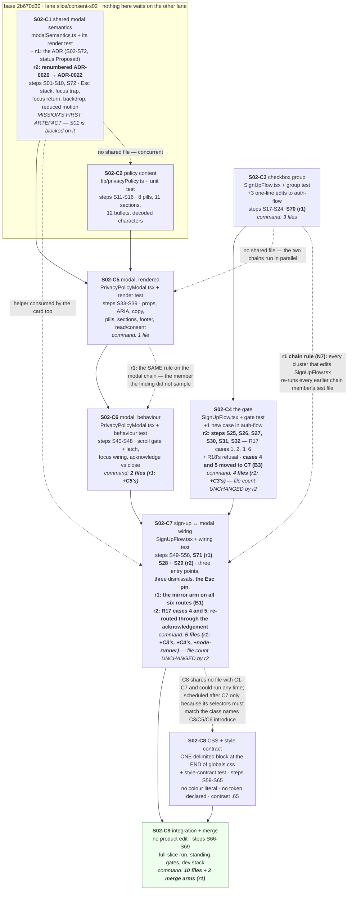
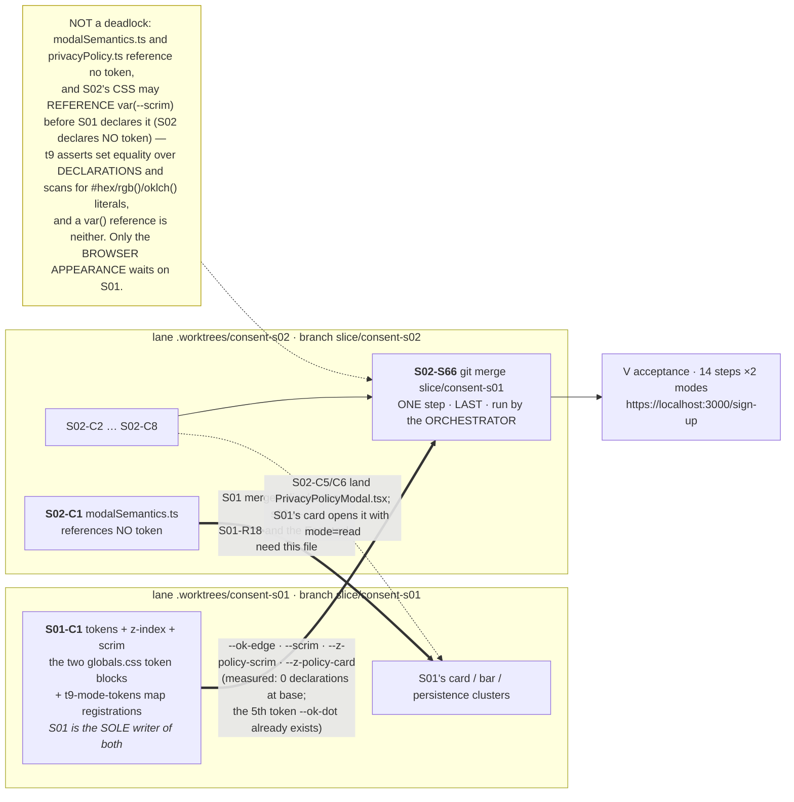
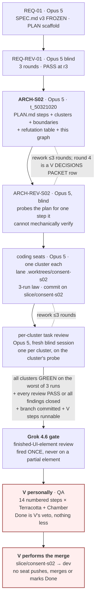
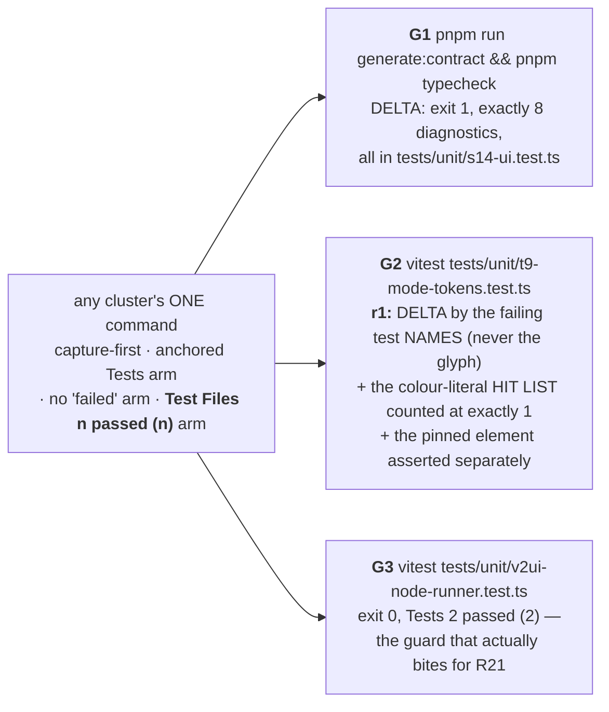

# Mission graph — slice S02 (sign-up privacy gate) · author ARCH-S02, 2026-09-06
**Updated by ARCH-S02-REWORK-R1, rework round 1** — the cluster commands' file counts changed
(N7's chain rule and its second member), three steps were appended, and the C9 edge gained the
two merge arms. Every change from that round is marked **r1**.
**Updated by ARCH-S02-REWORK-R2, rework round 2** — `S02-S28` and `S02-S29` (R17 cases 4 and 5)
move from `S02-C4` to `S02-C7` (**B3**), the ADR is renumbered to `ADR-0022` (`COMMON.md`
§10.23), and the not-a-deadlock note says REFERENCE rather than "declare" (**N10**). Every
change from that round is marked **r2** and tabulated in §r2 at the end of this file.
**No cluster's file count changed in r2, and no step was renumbered.**

**Lane:** `/Users/vladmihaimiron/Documents/DebateAIRO/dialectical-engine/.worktrees/consent-s02/dialectical-engine`
**Branch:** `slice/consent-s02`, based on `dev` @ `2b670d30` · lane `git status --short` = 0 entries
**Plan:** `docs/missions/consent-ui/slices/S02/PLAN.md` — **72 steps** (r1: 69 + `S02-S70`,
`S02-S71`, `S02-S72`; no step renumbered), 9 clusters, 24/24 SPEC trace both ways, 72/72
refutation rows
**Spine gate:** the planning-graph gate asks for V's yes on this image. Per the orchestrator's
standing ruling (row V-8) **the fleet proceeds by default and V vetoes**; this file is the
artefact V vetoes or accepts.

## The cluster graph

## The cross-slice edges — and why they are not a deadlock

**Conflict expected and accepted** (vertical-slice law §6): both lanes append a delimited block
at the end of `globals.css`. Resolution is both blocks, S01's first, S02's second. Not a reason
to serialize.

## Seats, gates and the merge point

## The standing gates every cluster reports (deltas, never colours)

**Why the gates are outside the guard, not inside it:** the lawful guard asserts a GREEN
summary with no `failed`; G1 and G2 are RED at base *by design* (`BASELINE.md`), so folding
them in would make every cluster command permanently red and unable to discriminate anything.
`BASELINE.md`'s own rule is "assert the DELTA, never the absolute", and a delta is a different
assertion.

**The fourth arm exists because ARCH-S02 measured a new variant of the acceptance-command
family:** `pnpm exec vitest run <existing> <missing>` runs only the existing file, prints
`Tests 17 passed (17)` and exits 0. Validated on known-good and known-bad input; appended to
`.hermes/TOOLING-TRAPS.md` as variant 7.

## r1 — what this rework changed in the graph, and why

| Change | Finding | Why it is a graph change and not only a text change |
|---|---|---|
| `C4` 3→4 files, `C7` 2→5 files | **N7** | The `C3 → C4 → C7` chain shares `SignUpFlow.tsx`, so a later cluster's regression into an earlier one's pins was invisible until `C9`. **This is the structural gap B1 fell through**: C4's six mirror cases ran before C7 existed, and C4's command never re-ran C7's file. |
| `C6` 1→2 files | **N7's class, second member** | `C5 → C6` share `PrivacyPolicyModal.tsx` and had the identical shape. A finding is a sample of a class (`heartbeat-protocol` §2.2); the sweep is complete — `C1`, `C2` and `C8` share a product file with nobody. |
| `C9` 9→10 files **+ two merge arms** | **N1** | `C9`'s mutant column claimed it detected "the merge losing S01's `globals.css` block" and could not. `run_c9` now asserts `grep -c -- '--scrim:'` → `2` and `grep -c -- '=== consent-ui S02 ==='` → `2`. **Consequence, accepted: `C9` cannot go green before the merge — correct, because `S02-S66` is its first step.** |
| `C1` gains the shared-modal-semantics ADR (**named `ADR-0020` in r1; renumbered to `ADR-0022-shared-modal-semantics.md` in r2 — see §r2**) | orchestrator note | The ADR was "warranted, not written by this seat" with no number and no owner. It is now step `S02-S72`, written by the C1 coding seat, status `Proposed`, with three mechanical arms and no vitest case — so `C1`'s command is unchanged. |
| `C3` gains `S02-S70`, `C7` gains `S02-S71` | **N3** | R03's "keyboard-toggleable" hook had no step at all. **Measured: jsdom 30.0.1 does not implement Space-activates-checkbox** (`clickEventsSeen=0`), so both steps assert the ACTIVATION event and hand the keystroke to V. |
| `C7`'s mirror arm on six route steps | **B1** | The one defect no step in the graph could see: the DOM says `false`, the R17 mirror says `true`, and `Create account` is computed from the mirror alone. |

**Nothing in the concurrency structure moved.** The chain rule adds test files that a cluster
RUNS, never files it WRITES, so the single-writer analysis behind `C1 ∥ C2`, `{C3→C4} ∥
{C5→C6}` and `C8 ∥ everything` is unchanged. The two-seat schedule is still
`C1∥C2 → {C3→C4} ∥ {C5→C6} → C7 → C8 → C9`.

**`modalSemantics.ts`'s exported surface did NOT change** — B1 lives entirely in
`SignUpFlow.tsx`. S01's lane can be written against the round-0 signature unchanged.

## r2 — what rework round 2 changed in the graph, and why

| Change | Finding | Why it is a graph change and not only a text change |
|---|---|---|
| `S02-S28` and `S02-S29` move `C4` → `C7`; `C4` 8→6 steps, `C7` 11→13 steps | **B3** | R17 cases 4 and 5 expect `Create account` **enabled**, and after C7's click rule the ONLY route that ticks `privacy-accepted` is the modal's acknowledgement — which does not exist until C7. Measured, three runs: `STAGE c4` reports `NO MODAL AT THIS STAGE` for both cases and `STAGE c7: 6/6 pass` (`probes/arch-s02-rework-r2-r17-post-c7-fixed.mjs`). **The r1 chain rule is what exposed it**: C7's command now RUNS `consent-signup-gate.test.tsx`, so under the old text a C7 seat was deadlocked — it could not go green without deleting its own click rule, and it may not edit C4's test. Routed as V-DECISIONS row **V-18**, default (a). |
| `C4` loses its only positive control | **B3, second-order** | Every step left in `C4` expects `disabled === true`, so `C4`'s command can no longer catch a `disabled` hard-coded `true`. That mutant now sits in `C7`'s mutant column, caught by `S02-S28` in its new home and independently by `S02-S53`. Stated in both cluster rows rather than left implicit. |
| `ADR-0020` → **`ADR-0022-shared-modal-semantics.md`** everywhere | orchestrator CORRECTION, `COMMON.md` §10.23 | `ADR-0019`/`ADR-0020` are reserved by the halted `translation` mission. `consent-ui`'s allocation is `ADR-0021` (S01-C2) and `ADR-0022` (S02-C1). 8 references in `PLAN.md` and 2 here. |
| the not-a-deadlock note says **REFERENCE**, not "declare" | **N10** | S02 declares no token (`COMMON.md` §10.8); `t9-mode-tokens.test.ts:376-377` asserts set equality over DECLARATIONS, and a seat reading the graph alone could have taken the old wording as licence to declare one. |

**Nothing in the concurrency structure moved in r2 either.** No cluster gained or lost a FILE:
`C4` still runs 4, `C7` still runs 5, `C9` still runs 10, and the two steps moved between
clusters that are already strictly sequential (`C3 → C4 → C7`, all three writing
`SignUpFlow.tsx`). The two-seat schedule is unchanged. **No step was renumbered** — `S02-S28`
and `S02-S29` keep their ids and their requirement (`R17`, whose trace row already read
`C4 · C7`); only their cluster, their test file and their route changed.
