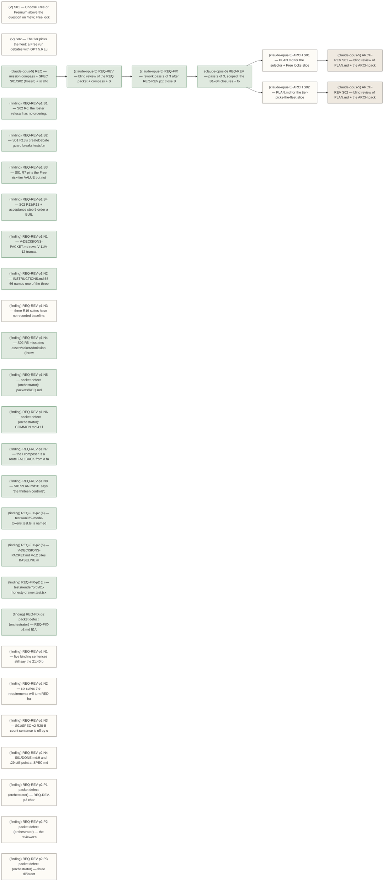

```mermaid
flowchart LR
  t_11abead2["(V) S01 — Choose Free or Premium above the question on /new; Free lock"]:::ready
  t_e4b4ab3a["(V) S02 — The tier picks the fleet: a Free run debates with GPT 5.6 Lu"]:::ready
  t_cb9482de["(claude-opus-5) REQ — mission compass + SPEC S01/S02 (frozen) + scaffo"]:::done
  t_e95f08a5["(claude-opus-5) REQ-REV — blind review of the REQ packet + compass + S"]:::done
  t_a4a6ea69["(claude-opus-5) REQ-FIX — rework pass 2 of 3 after REQ-REV p1: close B"]:::done
  t_485d6613["(claude-opus-5) REQ-REV — pass 2 of 3, scoped: the B1–B4 closures + fo"]:::done
  t_103dce54["(finding) REQ-REV-p1 B1 — S02 R6: the roster refusal has no ordering; "]:::done
  t_c0d928e3["(finding) REQ-REV-p1 B2 — S01 R13's createDebate guard breaks tests/un"]:::done
  t_bf631f0b["(finding) REQ-REV-p1 B3 — S01 R7 pins the Free risk-tier VALUE but not"]:::done
  t_90015321["(finding) REQ-REV-p1 B4 — S02 R12/R13 + acceptance step 9 order a BUIL"]:::done
  t_d316d314["(finding) REQ-REV-p1 N1 — V-DECISIONS-PACKET.md rows V-11/V-12 truncat"]:::done
  t_6f812bf4["(finding) REQ-REV-p1 N2 — INSTRUCTIONS.md:65-66 names one of the three"]:::done
  t_a5b40dbc["(finding) REQ-REV-p1 N3 — three R19 suites have no recorded baseline: "]:::ready
  t_30b2f287["(finding) REQ-REV-p1 N4 — S02 R5 misstates assertMakerAdmission (throw"]:::done
  t_25ca3234["(finding) REQ-REV-p1 N5 — packet defect (orchestrator): packets/REQ.md"]:::done
  t_83843b64["(finding) REQ-REV-p1 N6 — packet defect (orchestrator): COMMON.md:41 l"]:::done
  t_55b979c7["(finding) REQ-REV-p1 N7 — the / composer is a route FALLBACK from a fa"]:::done
  t_90bfab57["(finding) REQ-REV-p1 N8 — S01/PLAN.md:31 says 'the thirteen controls';"]:::done
  t_ca7e0ec5["(finding) REQ-FIX-p2 (a) — tests/unit/t9-mode-tokens.test.ts is named "]:::done
  t_be1a11d7["(finding) REQ-FIX-p2 (b) — V-DECISIONS-PACKET.md V-12 cites BASELINE.m"]:::done
  t_43263b80["(finding) REQ-FIX-p2 (c) — tests/render/prov01-honesty-drawer.test.tsx"]:::done
  t_37a8e5c8["(finding) REQ-FIX-p2 packet defect (orchestrator) — REQ-FIX-p2.md §1/c"]:::done
  t_dfd8f52d["(claude-opus-5) ARCH S01 — PLAN.md for the selector + Free locks slice"]:::ready
  t_57d602a5["(claude-opus-5) ARCH S02 — PLAN.md for the tier-picks-the-fleet slice "]:::ready
  t_0e278df0["(claude-opus-5) ARCH-REV S01 — blind review of PLAN.md + the ARCH pack"]:::todo
  t_08c8abe2["(claude-opus-5) ARCH-REV S02 — blind review of PLAN.md + the ARCH pack"]:::todo
  t_c1cf2c21["(finding) REQ-REV-p2 N1 — five binding sentences still say the 21:40 b"]:::ready
  t_4a7ccb0c["(finding) REQ-REV-p2 N2 — six suites the requirements will turn RED ha"]:::ready
  t_9e274b2d["(finding) REQ-REV-p2 N3 — S01/SPEC-v2 R20-B count sentence is off by o"]:::ready
  t_98313d55["(finding) REQ-REV-p2 N4 — S01/DONE.md:9 and :29 still point at SPEC.md"]:::ready
  t_fb6b20c7["(finding) REQ-REV-p2 P1 packet defect (orchestrator) — REQ-REV-p2 char"]:::ready
  t_2db5d7c1["(finding) REQ-REV-p2 P2 packet defect (orchestrator) — the reviewer's "]:::ready
  t_c6648f8a["(finding) REQ-REV-p2 P3 packet defect (orchestrator) — three different"]:::ready
  t_cb9482de --> t_e95f08a5
  t_e95f08a5 --> t_a4a6ea69
  t_a4a6ea69 --> t_485d6613
  t_485d6613 --> t_dfd8f52d
  t_485d6613 --> t_57d602a5
  t_dfd8f52d --> t_0e278df0
  t_57d602a5 --> t_08c8abe2
  classDef done fill:#dfe9df,stroke:#3E7A4E
  classDef running fill:#f3ece0,stroke:#A8823E
  classDef ready fill:#fdfbf6,stroke:#6E675C
  classDef review fill:#e6e8e8,stroke:#3D5A80
  classDef blocked fill:#f4e5de,stroke:#B0432F
  classDef todo fill:#efe9e0,stroke:#6E675C
  classDef scheduled fill:#efe9e0,stroke:#6E675C
  classDef triage fill:#efe9e0,stroke:#6E675C
```

_rendered 2026-09-09 22:06 from board `debate-tiers` — 33 nodes, 7 edges_
