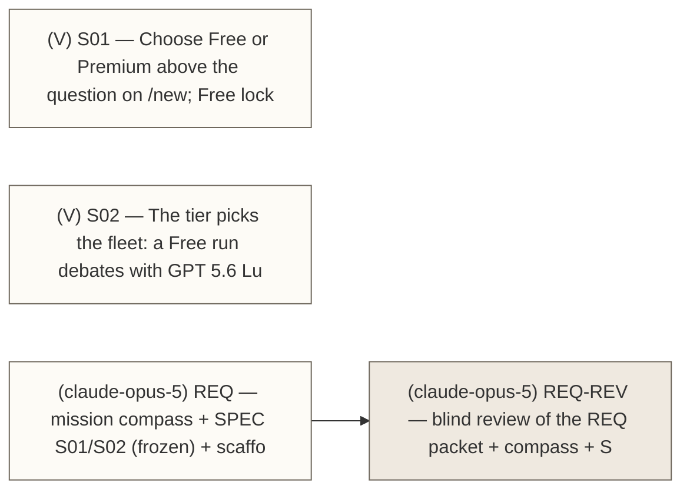

```mermaid
flowchart LR
  t_11abead2["(V) S01 — Choose Free or Premium above the question on /new; Free lock"]:::ready
  t_e4b4ab3a["(V) S02 — The tier picks the fleet: a Free run debates with GPT 5.6 Lu"]:::ready
  t_cb9482de["(claude-opus-5) REQ — mission compass + SPEC S01/S02 (frozen) + scaffo"]:::ready
  t_e95f08a5["(claude-opus-5) REQ-REV — blind review of the REQ packet + compass + S"]:::todo
  t_cb9482de --> t_e95f08a5
  classDef done fill:#dfe9df,stroke:#3E7A4E
  classDef running fill:#f3ece0,stroke:#A8823E
  classDef ready fill:#fdfbf6,stroke:#6E675C
  classDef review fill:#e6e8e8,stroke:#3D5A80
  classDef blocked fill:#f4e5de,stroke:#B0432F
  classDef todo fill:#efe9e0,stroke:#6E675C
  classDef scheduled fill:#efe9e0,stroke:#6E675C
  classDef triage fill:#efe9e0,stroke:#6E675C
```

_rendered 2026-09-09 20:15 from board `debate-tiers` — 4 nodes, 1 edges_
