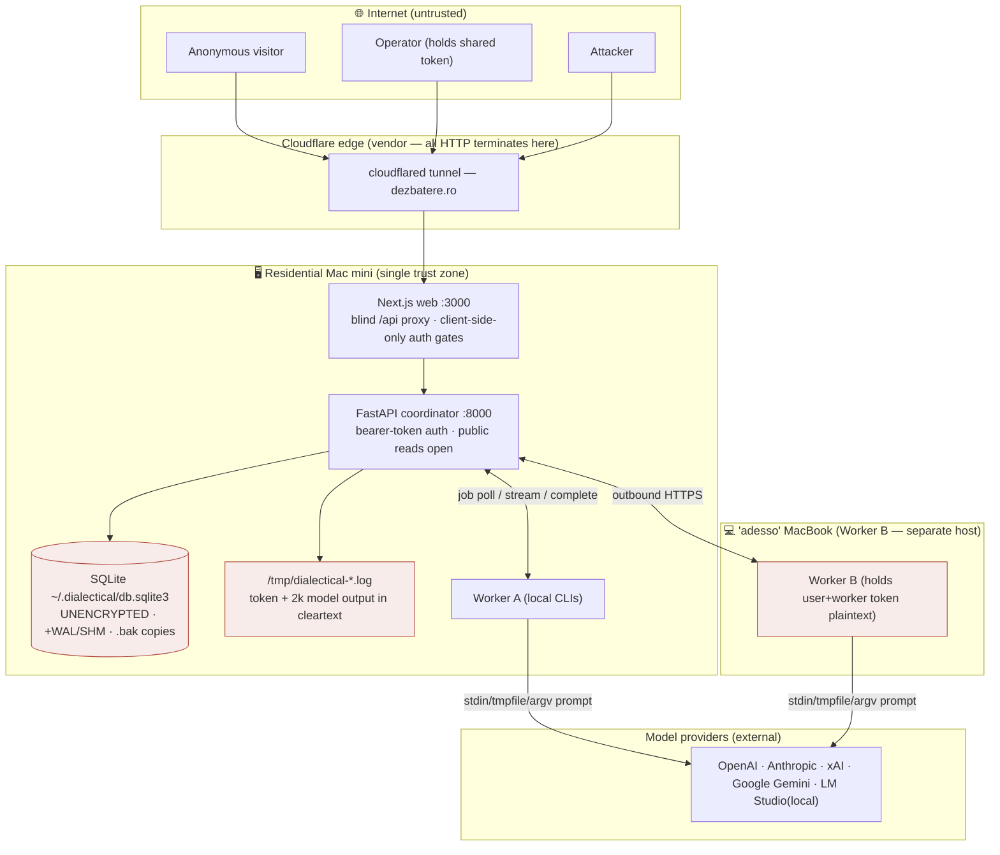
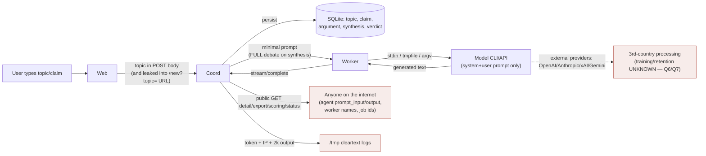

# Wave 1 — Current State, Threat Model, and Blocking Decisions

**Mission:** Individual Accounts, Privacy-by-Design, and Secure Operations
**Tree:** `apps/dialectical-engine` (in scope) · `DebateAI-V3` and other apps **out of scope**
**Mode:** Planning/inventory only — no product code, no schema changes.
**Produced:** 2026-08-17. Every current-state claim is cited to a file/line, endpoint, table, or env var, or marked `UNKNOWN`. Per-area detail lives in `research/R1..R5`.

> **Reading note (mission Operating Law 5 & 6):** No legal or standards claim below is a compliance conclusion. Where a lawful basis, transfer mechanism, or "GDPR" outcome would be asserted, it is written `UNVERIFIED — counsel`. Phrases like "GDPR compliant", "end-to-end encrypted", "anonymous" are avoided by rule.

---

## 1. Executive summary & highest-risk findings

Dialectical Engine today is a **single-operator, local-first** debate platform whose entire human-authorization model is **one shared bearer token**. It has **no user accounts, no sessions, no per-user ownership, and no lawful data-erasure path**. The mission's asks (2FA per user, DB "3FA", GDPR/ROPA/DSAR, RBAC, pseudonyms, audit) all land on a foundation that must first *grow the concept of "a user"* — this is a foundational architectural change, not a feature.

The good news, evidenced: the web tier is unusually clean for privacy work — **zero cookies, zero third-party/analytics calls** (proven by exhaustive grep), one strictly-necessary localStorage key, and **no HTML-injection XSS surface** (pure React text rendering). Prompt-injection has real partial defenses (delimiter+escape guard on the legacy path; a strong SSRF citation guard). So the gap is concentrated in *identity, secrets handling, deletion, and operational hygiene* — not in a sprawling tracker mess.

**Highest-risk findings (severity-ordered):**

| # | Finding | Evidence | Why it's top-risk |
|---|---|---|---|
| H1 | **User auth token printed in plaintext to a world-readable log** | `coordinator/app/main.py:43` → `/tmp/dialectical-coordinator.out.log` (`deploy/launchd/coordinator.plist:115-118`); `deploy/README.md:16` tells the operator to `tail` it | The single secret that *is* the admin account, written to a readable file. Full-instance compromise from one log read. |
| H2 | **One shared token = all human authority, no accounts/sessions/expiry/revocation** | `coordinator/app/core/auth.py:24,62-69`; no users/sessions table (`R1 §2`) | No per-user scoping, no MFA anchor, no revocation short of a global reset that logs everyone out. Everything the mission wants attaches here. |
| H3 | **Agentic codex CLI on the worker runs untrusted debate content with `--sandbox workspace-write`, no `--cd`, and full-env inheritance** | `worker/app/adapters/codex_cli.py:78`; `subprocess_base.py:96` (`env={**os.environ,...}`) | A jailbroken debate prompt can drive file writes + stage secret exfiltration. This is the mission's LLM-isolation invariant, violated today. |
| H4 | **No deletion path anywhere; DR-188 forbids it** | `DELETE /api/debates/{id}` = soft archive (`orchestrator.py:1062-1076`); no `db.delete`/`DELETE FROM` in app; DR-188 data-preservation law | Direct collision with GDPR Art. 17 erasure. `UNVERIFIED — counsel`, but the engineering fact is: **no erasure capability exists**. |
| H5 | **Public debate detail + `/api/backends/status` leak internal metadata & worker/host identity to anyone** | `serialization.py:753-946`; `workers.py:199-234` | Unauthenticated exposure of agent prompt_input/output, worker names (≈host/person), job ids. IDOR/BOLA-by-design once debates have owners. |
| H6 | **Plaintext credentials at rest on every worker host** | `worker/app/config.py:102-132` (`worker_token`+`user_token`, no file mode); `install_worker.py:96,121,126` (API keys into LaunchAgents plist) | Any worker-host compromise = full admin + provider keys. |
| H7 | **Unencrypted SQLite + accumulating unencrypted `.bak` backups; no encryption at rest** | `db.py` (no SQLCipher); `flip-plan-2026-07.md:95-97` | All topics/prompts/outputs/hashed-creds in cleartext on disk. Sizing depends on Q10/Q11. |
| H8 | **Production is one residential Mac mini behind a Cloudflare tunnel; no CI, no secret scanning, `.env` loaded but not gitignored** | `ManualSetup_TODO.md:39-47`; `B/.gitignore` (no `.env`); no `.github/` | Availability SPOF + one accidental key-file commit away from secret leak. |

---

## 2. Current-state architecture & trust boundaries

**Trust-boundary reading:** the Mac mini is essentially **one flat trust zone** — coordinator, DB, logs, and Worker A share it; the only real boundary is the network edge (Cloudflare) and the worker-token seam to Worker B. There is no boundary between "the app" and "the model subprocess" (full-env inheritance, H3), and no boundary between "a user's data" and "another user's data" (no accounts, H2/H5).

---

## 3. Current-state repository findings (cited)

Condensed; full detail in `research/R1..R5`.

**Identity & auth (R1):** shared token in `localStorage["dialectical:userToken"]` (`web/lib/api.ts:16-34`); validated server-side `auth.py:62-69`; bcrypt(12)/PBKDF2 hashing `auth.py:32-49`; **no users/sessions/accounts table**; worker identity is real and separate (own hashed token, `entities.py:126`); `blocked_auth` is a worker heartbeat *status string*, not a lockout (`workers.py:41-46`). All web auth-gating is client-side UI only; enforcement is coordinator-side; the `/api/[...path]` proxy forwards everything blindly.

**Data & persistence (R2):** 17 tables (`entities.py`); SQLite default `~/.dialectical/db.sqlite3`, **no encryption at rest**; personal-data/content columns catalogued (topics, claims, arguments, syntheses, verdicts, worker names, `node_feedback_votes.user_identity_hash`); **no emails/accounts/profiles exist**; **soft-archive only, no hard delete** (`orchestrator.py:1062-1076`); latent cascades wouldn't cover half the content tables; unencrypted `.bak` backups accumulate.

**Web surface (R3):** 6 routes; **zero cookies, zero third-party/analytics** (proven); one localStorage key; **no security headers/CSP/CORS at Next or tunnel tier**; **no HTML-injection XSS** (React text only, no `dangerouslySetInnerHTML` in app); logger redaction started (`web/lib/observability/logger.ts`) but leaks `userId`/`sessionId`/free-text/bare-token values; **no privacy/terms/consent surface exists**; topic leaks into `/new?topic=` URL query.

**Workers & LLM (R4):** minimal per-job prompts EXCEPT synthesis (serialises the whole debate); **full-env inheritance to every CLI child** (`subprocess_base.py:96`); **codex worker adapter `--sandbox workspace-write`, no `--cd`** (agentic in the worker source tree) vs the coordinator provider's safer read-only+tempdir; no subprocess generation timeout; providers = OpenAI/Anthropic/xAI/Gemini/LM Studio via CLI-OAuth-or-key (`ModelAuth_TODO.md`); legacy prompt path has a "treat as data" delimiter+escape guard, **v2 path does not on every branch**; strong SSRF citation guard at *fetch* time; **zero prompt-injection tests**; a compromised worker can claim any job across all debates and forge results (no content signing, no per-debate isolation).

**Ops & assurance (R5):** production = residential Mac mini + Cloudflare tunnel (`ManualSetup_TODO.md` shows it live as of 2026-06-15); Worker B on a corporate-named laptop; **no CI, no secret scanning, `.env` not gitignored**; token + 2k of model output printed to `/tmp` logs (`main.py:43`, `worker/app/main.py:266`) despite the coordinator's own "no LLM text in logs" law (`oplog.py:9-11`); no log rotation/retention; no incident-response/backup policy; watchdog auto-invokes Codex for repair, hard-coded to a prior operator's paths; single-operator assumption throughout (`AGENTS.md`, README).

---

## 4. Data-flow diagram (where user content & metadata travel)

Every debate's content reaches: the DB (forever, unencrypted), the public read endpoints (by design), the model providers (external, possibly outside the EU), and — for the token and up to 2000 chars of output — cleartext `/tmp` logs.

---

## 5. Draft data inventory (ROPA seed — mostly BLOCKED on §10)

Full ROPA rows require an evidenced operator, systems, and vendors (Operating Law 12). The **operator legal entity (Q1), serving countries (Q2), provider retention/training (Q7), and hosting location (Q10/Q11) are all unanswered**, so lawful basis, transfer mechanism, and geographic fields are `BLOCKED`/`UNVERIFIED — counsel`. What *is* evidenced:

| Processing activity | Data categories (evidenced) | Storage (evidenced) | Recipients (evidenced) | Lawful basis | Transfer mech. | Retention |
|---|---|---|---|---|---|---|
| Debate creation & display | Topic, claims, arguments, synthesis (user + LLM content); timestamps | SQLite `~/.dialectical/db.sqlite3` (unencrypted) | Public read endpoints; model providers | `UNVERIFIED — counsel` | `BLOCKED` (Q6/Q7/Q11) | **None — no deletion (H4)** |
| Model generation | Prompt text (topic/claim/context; full debate on synthesis) | Transient job payload; output in DB; 2k in /tmp logs | OpenAI/Anthropic/xAI/Gemini (Q6) | `UNVERIFIED — counsel` | `BLOCKED` (Q7) | `BLOCKED` (Q7) |
| Auth | Shared token (hashed in DB; plaintext in /tmp log, worker configs, localStorage) | DB `settings`; /tmp; worker hosts; browser | — | Security requirement | n/a | No expiry/rotation |
| Feedback votes | `user_identity_hash` (token-derived), vote, timestamp | DB `node_feedback_votes` | — | `UNVERIFIED — counsel` | n/a | None |
| Worker/fleet metadata | Worker name (≈host/person), capabilities, last_seen, IP (logs) | DB `workers`; /tmp uvicorn logs | Public `/api/backends/status` | `UNVERIFIED — counsel` | `BLOCKED` (Q11) | None |

**No special-category data is *intended*, but Q5 (can users submit personal/special-category data in prompts?) is unanswered — and prompts flow to external providers, so this is a blocking privacy question, not a detail.**

---

## 6. Threat model

| Actor | Can do today | Cannot do | Key gap |
|---|---|---|---|
| **Anonymous visitor** | Read all debate content, SSE, export, scoring, QBAF runs, worker roster (names/jobs); spend IP-spoofable rate budget | Create/mutate; reach settings/ops | Public metadata over-exposure (H5) |
| **Registered user** | — *does not exist yet* | — | The entire mission's subject (H2) |
| **Operator (shared token)** | Everything: create/archive, regenerate, settings (routing, model enable, spend caps), register/rotate workers, all ops | — | No per-user scoping; token over-copied (H1/H6) |
| **Compromised worker** | Claim any job across all debates, read those prompts (full tree on synthesis), forge any result into the DB shown to users (no signing), read own-env secrets | Reach human-gated admin (unless user token stored on host — it is) | No per-debate isolation, no content signing (R4 §6) |
| **Model provider** | Receives prompt text (full debate on synthesis) | — | Training/retention/region UNKNOWN (Q6/Q7) |
| **DB operator / host** | Read everything (unencrypted SQLite + /tmp token) | — | No encryption at rest, no access separation (H1/H7) |
| **Insider / prior operator** | Watchdog auto-runs Codex; hard-coded prior-operator paths | — | Autonomous repair + stale identity in ops (R5 §7) |
| **Prompt-injection attacker** | Via codex worker: induce workspace file writes, stage secret exfiltration; via others: corrupt debate content | Direct SQL/shell (non-codex); stored-XSS (React-escaped) | Agentic codex + full-env + no cwd isolation (H3) |
| **Compromised dependency** | No CI/scanning to catch it; `.env` not gitignored | — | Supply-chain blind spot (H8) |

---

## 7. Gap analysis (current → risk → target → evidence)

Legend: **[Now]** required regardless of launch shape · **[Public]** required only if Wave 1 answers show public multi-user.

| Area | Current state | Risk | Required target (direction only — Wave 2 designs it) | Class |
|---|---|---|---|---|
| Identity | One shared token, no accounts | H2 | Individual accounts, sessions, ownership; migrate off shared token | **[Now]** security |
| Secrets at rest | Token in /tmp log; plaintext on workers | H1/H6 | Stop printing token; secret custody sized to hosting | **[Now]** security |
| Session/MFA | None | H2 | HttpOnly-cookie sessions; TOTP per user; WebAuthn compared for admin | **[Now]** legal+security |
| Authorization | Public reads open; client-side gates; no ownership | H5 | Deny-by-default server-side; object-level IDOR/BOLA tests | **[Now]** security |
| Deletion | Archive-only; DR-188 forbids delete | H4 | Erasure/redaction/tombstoning path; **reconcile DR-188 with GDPR Art. 17** | **[Now]** legal — `UNVERIFIED — counsel` |
| Encryption at rest | None | H7 | Classification-driven; TOTP-seed + recovery-code encryption; sized to hosting | **[Now]** security |
| LLM isolation | Agentic codex, full-env, no cwd | H3 | Env allowlist, non-agentic/read-only, cwd isolation, injection tests | **[Now]** security |
| DB access & audit | Shared creds, no tamper-evident audit | — | Separate service/human identities; audit log per mission §E | **[Now/Public]** security |
| Public exposure | Detail/status leak internals | H5 | Private-by-default; minimise public serialization | **[Public]** product+legal |
| Privacy centre / DSAR | None | H4 | Sized to operator model (runbook+export/delete min, or suite) | **[Now]** legal |
| Cookies/consent | Zero cookies/analytics (clean) | low | Informational cookie notice (not a fake banner) unless analytics added | **[Now]** legal (light) |
| Vendor/transfer register | Providers used, terms UNKNOWN | — | Register + DPA/SCC/DPF/TIA per vendor actually used | **[Now]** legal — `UNVERIFIED — counsel` |
| Ops/assurance | No CI/scanning; /tmp logs; SPOF | H8 | CI + secret/dep scanning; log hygiene; backup/IR sized to hosting | **[Now/Public]** security |

---

## 8. Decisions & clarifying questions that block architecture

Per Operating Law 4, Wave 2 (target architecture) **cannot** start until these are answered. Answers already evidenced from the repo are filled; the rest are **for V**. Do not treat any blank as answered.

### Repo-evidenced (confirm or override)

- **Q19 (launch shape):** Evidence says **local-first single-operator today**, but a **public tunnel at dezbatere.ro was live as of 2026-06-15** (`ManualSetup_TODO.md:39-47`). → *Which is the launch target: stay local-first, private-hosted, or public internet product?* **Blocks nearly everything.**
- **Q6 (providers):** Evidenced enabled: **OpenAI, Anthropic, xAI, Google Gemini, LM Studio (local)** (`R4 §3`). Confirm the launch set.
- **Q9 (self-built vs IdP auth):** No IdP wired; mission text leans self-built. Confirm — build-vs-buy is a Wave 2 fork.
- **Q10/Q11 (DB/hosting/location):** Evidenced **SQLite on a residential Mac in Romania behind Cloudflare**. Confirm the production target and where data/backups/keys will live.
- **Q20 (scope):** `apps/dialectical-engine` only; `DebateAI-V3` out. **Answered by the mission file** unless you override.

### For V — the answer packet (blank = needs your ruling)

1. **Q1** — Which legal entity operates the service? _____
2. **Q2** — Which countries served at launch? _____
3. **Q3** — Are minors allowed? _____
4. **Q4** — Debates private or public by default? _____
5. **Q5** — May users submit personal / special-category data in prompts? (prompts flow to external providers) _____
6. **Q7** — Are provider API requests retained or used for training? (per provider) _____
7. **Q8** — External email vendor for verification, or self-hosted SMTP / none? _____
8. **Q12** — What must happen to public debates after account deletion? (**collides with DR-188 — your ruling shapes the erasure design**) _____
9. **Q13** — Must a pseudonym stay stable across all public debates, or rotate/per-debate? _____
10. **Q14** — Any analytics/marketing tech planned? (today there is none — clean slate) _____
11. **Q15** — Acceptable recovery if a user loses BOTH TOTP and recovery codes? _____
12. **Q16** — Which staff roles will actually have production access? (today: one operator) _____
13. **Q17** — Real retention periods the business needs? _____
14. **Q18** — Consumer-facing, enterprise-facing, or both? _____

### The one carve-out I must flag before Wave 2

**DR-188 (data-preservation law: "never delete debate data, on any environment, forever") directly conflicts with GDPR Art. 17 (right to erasure) and Art. 5(1)(e) (storage limitation).** The standard reconciliation is **crypto-shredding** (destroy the key, not the row) or **pseudonym-severance + tombstoning** rather than physical deletion — which can honor both laws — but that is **your ruling to make, not mine to assume** (`UNVERIFIED — counsel`; Q12 depends on it). Wave 2's deletion semantics cannot be designed until you rule on how personal-data erasure coexists with DR-188.

---

## Wave 1 stop

Per mission §5, Wave 1 ends here: the artifact exists, every current-state claim is cited or marked UNKNOWN, §10 is fully listed, and the last section is a human-answer packet — **not** a chosen target architecture. **No target architecture, RBAC matrix, encryption spec, or vendor conclusion is produced.** Wave 2 opens only when V returns the §10 answers (or authorizes named assumptions) **and** seats the loop-ownership election.
