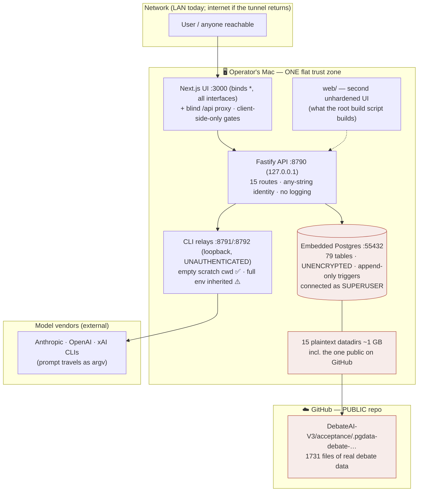
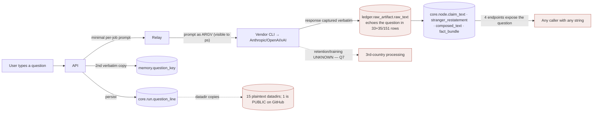

# Wave 1 — Current State, Threat Model, and Blocking Decisions

**Mission:** Individual Accounts, Privacy-by-Design, and Secure Operations
**Target:** `dialectical-engine` (TypeScript: Fastify API, embedded Postgres, Next.js UI, CLI relays)
**Mode:** Planning/inventory only — no product code, no schema changes.
**Produced:** 2026-08-17 by five parallel read-only sweeps (S1 auth, S2 personal data, S3 UI, S4 ops, S5 LLM isolation). Every claim cites file:line, table, endpoint, or env var, or is marked `UNKNOWN`. Full detail: `research/S1..S5`.

> **Legal posture (charter laws 5 & 6):** nothing below is a compliance conclusion. Lawful bases, transfer mechanisms, and GDPR outcomes are marked `UNVERIFIED — counsel`. The phrases "GDPR compliant", "end-to-end encrypted", "prompt-injection proof", and "anonymous" (for pseudonymised data) are avoided by rule.

---

## 1. Executive summary & highest-risk findings

The engine is a **local-first, single-operator research instrument** whose identity layer was **deliberately deferred** so the debate algorithm could be built first (V, 2026-08-17). That deferral is now due. The good news, evidenced: the hardest part is already done — **per-user tenancy exists and is proven**. Every owned resource filters on `core.run.asker_id` in SQL, with integration tests against real Postgres showing a foreign asker gets 404. **We are adding a front door to a house whose interior walls already stand.**

The bad news is concentrated in three places: **there is no verification behind that door**, **nothing can ever be deleted**, and **a live debate database is public on GitHub**.

| # | Finding | Evidence | Why it's top-risk |
|---|---|---|---|
| **H1** | **1,731 files / 72 MB of a plaintext Postgres datadir with real debate content are committed and pushed to the PUBLIC repo `DebateAIRO/debateairo`** | `git ls-tree origin/dev \| grep -c pgdata-debate` → 1731; `gh repo view` → PUBLIC; added in `c18991d`; matched no `.gitignore` rule | Live data exposure. Contains `ledger.raw_artifact.raw_text` (verbatim model output), questions, answers. **Orchestrator-caused; contained 2026-08-17 (§9).** |
| **H2** | **There is no authentication.** Any non-empty string is a valid credential | `apps/api/src/index.ts:113-123` — SHA-256 of a caller-chosen string becomes the identity; no comparison against any stored value; pinned as intended by `tests/unit/api.test.ts:557-561` | Everything the mission wants (2FA, RBAC, audit, DSAR) presumes an identifiable user |
| **H3** | **Erasure is impossible by construction.** `core.reject_mutation()` makes **77 of 79 tables** physically refuse UPDATE/DELETE; DR-188 elevates preservation to law | `migrations/0000_s00.sql:31-39` + 15 migrations attaching the trigger; DR-188 `decisions-ledger.md:1611` | Direct collision with GDPR Art. 17. V's crypto-shredding ruling is the resolution — but nothing implements it |
| **H4** | **The user's question exists in 9 places, 3 of them verbatim copies** — and is empirically embedded in model output | `core.run.question_line`, `memory.question_key.canonical_question_text`, `memory.pull_record.payload_snapshot`; measured echoes: 33+35/151 `raw_artifact`, 24/64 `stranger_restatement`, 11+16/64 `node.claim_text`, 4 `composed_text` | **There is no single point of erasure.** Nulling one column erases nothing |
| **H5** | **`decision_owner` / `action_owner` are required free-text fields designed to hold other people's names**, stored inside `core.run.ask_contract` jsonb | `packages/contract/src/index.ts:114-115`; UI form `web/app/new/page.tsx:57-58` | Third-party personal data → GDPR Art. 14 duties toward people who never used the app. Invisible to any column-level ROPA. **V ruled: drop from the user-facing ask (§8)** |
| **H6** | **Prompt-injection can pass its own review**, and the CLI transport lets untrusted text forge a system turn | `acceptance/relay-core.ts:59-64` flattens roles into an unescaped `[role]` argv string; conformance/R9 verifiers are LLM calls reading the same poisoned text | The debate's integrity claim is the product. This is the attack that voids it |
| **H7** | **The app connects to Postgres as the bootstrap superuser** with a password hardcoded in tracked source; the ~40 least-privilege GRANTs target roles that are all `NOLOGIN` | `acceptance/standing-db.ts:7-8,37`; roles in `migrations/0000_s00.sql:292,295`, `0023:4-13` | A superuser bypasses REVOKE and can disable the append-only triggers in two statements. The privilege model is designed but **inert** |
| **H8** | **Zero encryption at rest, zero assurance automation** | No `CREATE EXTENSION`, no `bytea` column, `sslmode=disable`; no CI, no pre-commit, no secret scanning, no SAST | FileVault is the only at-rest control and is inert while booted. Nothing would have caught H1, and nothing would catch the next one |
| **H9** | **No audit trail of any kind** | `Fastify({ logger: false })` (`apps/api/src/index.ts:126`); no Postgres `log_connections`/`log_statement` | Clean in that no token leaks — but a hosted breach would be entirely unreconstructable, and the mission explicitly asks for audits |
| **H10** | **A second, equally unhardened UI exists in `web/`** — and the root `build` script builds it, not `apps/ui` | `package.json:12`; `web/lib/api.ts:28,32,37` mirrors `apps/ui/lib/api.ts` | Every hardening lands twice, or one must be deleted |

---

## 2. Current-state architecture & trust boundaries

**Reading:** the host is **one flat trust zone**. The only real boundaries today are (a) the network edge, (b) the relay's empty-cwd containment (CONT-01), and (c) the SQL `asker_id` filter — which is genuine but sits behind a door with no lock. There is **no boundary between the app and the model subprocess** (full env inheritance), and **none between the app and the database** (superuser).

---

## 3. Current-state findings (cited; condensed from S1–S5)

**Identity (S1).** `resolveSession` accepts any non-empty string; `asker_id = "asker:" + sha256(token)`; no registry, expiry, rotation, or revocation. `x-operator-dev-token` is a **dead header** (the OPERATOR branch is unreachable). **`caller_scope` is attacker-controlled** — persisted from the request body (`apps/api/src/index.ts:434`), not the session. All 15 routes require a token; **two dev routes and `/v1/deployment` are unscoped (cross-tenant)**. `contractInventory` declares 12 of the 15 live routes — a review trusting it would miss the two privileged dev routes. **What holds:** per-asker isolation in SQL, proven against real Postgres (`tests/integration/database.test.ts:617-651`, `acceptance/ceremony.test.ts:475-480`).

**Personal data (S2).** **79 tables** (`schema.ts` mirrors only 63 — a ROPA built from it under-reports by 20%). Personal data today: questions, free-text `user_input` steers, pseudonymous `asker_id`/`session_id`, `decision_owner`/`action_owner`, `value_hinge.weight_owner`. **No email, password, or credential column exists anywhere.** Retention is **infinite** — the 7-day/180-day `livenessPolicy` only flips a badge, "archived" is a reversible marker, and **no scheduler runs at all**.

**UI (S3).** Six routes; **zero cookies beyond one auth mirror, zero third-party origins, zero analytics** (proven with a positive-control grep after the agent caught its own false negative). Token lives in **localStorage *and* a non-`HttpOnly`, non-`Secure` cookie**. **No CSP, HSTS, X-Frame-Options, Referrer-Policy** — the app is framable. **XSS surface is effectively closed** (no `dangerouslySetInnerHTML`, no markdown renderer, all model output is escaped JSX text). The `/api` proxy **forwards every header both ways**, so the token cookie leaks upstream as an undesigned second channel and CORS policy is entirely the API's. **No privacy policy, terms, or notice exists** — on an EU-facing brand (`dezbatere.ro`).

**Operations (S4).** No CI, no pre-commit, no secret scanning, no SAST, no dependency scanning. Three `.env` files are tracked (all benign today) and **no `.gitignore` rule covers `.env*`** — the pattern of committing them is established. `HATCHET_CLIENT_TOKEN` is a **mandatory** secret for the non-acceptance stack, which DR-179's "zero keys" audit does not cover. **Backups:** 15 unencrypted datadirs (~1 GB) on the same disk, no off-machine copy, no restore test, one named `-corrupt`; DR-188 makes retention **infinite by law**. Deployment is ruled (ADR-0018: Docker Compose on Hetzner behind Cloudflare) but **unbuilt** — `deploy/` holds two files and TLS is unspecified.

**LLM isolation (S5).** CONT-01 is real and verified. But it removed *ambient* context, not capability: **grok has an unused `--sandbox` flag**, codex's `read-only` blocks writes not reads, and **the full parent environment is inherited** — including `DATABASE_URL` and `SSH_AUTH_SOCK` (a live agent socket). The relay endpoint is **unauthenticated on loopback**; `max_tokens` is silently ignored on the CLI path; a SIGTERM-ignoring child **hangs the relay forever**. **Verified clean:** SQL parameterised, no shell path from model output, no HTML sink, no server-side citation fetch.

---

## 4. Data-flow diagram

---

## 5. Draft data inventory (ROPA seed — build from `migrations/`, not `schema.ts`)

| Processing activity | Data categories (evidenced) | Storage | Recipients | Lawful basis | Transfer | Retention |
|---|---|---|---|---|---|---|
| Debate creation & display | Question text (9 locations), claims, arguments, verdicts; timestamps | Postgres (unencrypted) + 15 datadir copies | Any caller with any token; model vendors | `UNVERIFIED — counsel` | `BLOCKED` (Q7/Q11) | **None — erasure impossible (H3)** |
| Model generation | Prompt (question + local context) as **argv**; verbatim response | `ledger.raw_artifact` (immutable) | Anthropic/OpenAI/xAI | `UNVERIFIED — counsel` | `BLOCKED` (Q7) | Provider default `UNKNOWN` |
| Identity | `asker_id`/`session_id` = sha256(caller-chosen string) | `core.run`, `memory.*`, `scorecard.*` | — | Security requirement | n/a | Infinite |
| **Third-party names** | `decision_owner`, `action_owner` (free text) | `core.run.ask_contract` jsonb | — | **Art. 14 duty — `UNVERIFIED — counsel`** | n/a | Infinite |
| Steering / investigations | `investigation_request.user_input` (free text) | `core.investigation_request` | — | `UNVERIFIED — counsel` | n/a | Infinite |
| Evidence | Third-party source excerpts | `evidence.evidence_item.excerpt` | — | copyright + others' PD `UNVERIFIED` | n/a | Infinite |

**Q5 (may users submit personal/special-category data in questions?) is unanswered and blocking** — questions flow verbatim to external vendors with no redaction.

---

## 6. Threat model

| Actor | Can do today | Cannot do | Key gap |
|---|---|---|---|
| **Anyone reachable on the network** | Type any string → full asker identity; read all their own debates; dump the whole deployment register + scorecards; **fire unlimited debates spending real model budget** (no rate limit, no quota) | Read another asker's runs (SQL-scoped) | H2 + no rate limiting |
| **Registered user** | *Does not exist* | — | The mission's subject |
| **Operator** | Everything; also the only human role | — | No role separation exists |
| **Someone who learns a user's token string** | Becomes them permanently — every debate, answer, inspection, ledger digest, event stream; unlink their memory; submit investigations as them | — | Identity is offline-reconstructible; **no revocation path** |
| **A model / prompt-injection** | Corrupt debate content; poison a review verdict; **pass its own conformance/R9 review**; forge a system turn via the `[role]` flattening; fabricate lookup-grade citations; DoS via uncapped input | SQL, shell, XSS, SSRF, file writes (verified clean) | H6 |
| **A model that regains tool use** (grok demonstrably did) | Read the repo and all three vendor credential stores; read `DATABASE_URL` and use `SSH_AUTH_SOCK`; reach the DB (password is in tracked source); call the unauthenticated relay | — | S5 G1 |
| **Model vendors** | Receive question + local context verbatim | — | Retention/training `UNKNOWN` (Q7) |
| **DB operator / host** | Read everything; disable append-only triggers (superuser) | — | H7 |
| **The public internet** | **Read the leaked datadir on GitHub** | — | H1 |
| **Compromised dependency** | Nothing would detect it | — | H8 |

---

## 7. Gap analysis

**[Now]** = required regardless of launch shape · **[Public]** = required once registration opens.

| Area | Current | Target direction (Wave 2 designs it) | Class |
|---|---|---|---|
| Exposure | Datadir public on GitHub | Contained (§9); history purge is V's call | **[Now]** security |
| Identity | Any string = identity | Real credentials, verified sessions, revocation | **[Now]** security |
| MFA | None | **WhatsApp (V's steer)** + TOTP alternative; admin factor compared separately | **[Now]** legal+security |
| Authorization | Owner-scoped SQL ✅; 3 unscoped routes; `caller_scope` from body | Deny-by-default; scope from session; IDOR/BOLA tests per route | **[Now]** security |
| Erasure | Impossible (77/79 tables) | **Crypto-shredding per V's ruling**; public debates stay, private debates user-deletable | **[Now]** legal |
| Encryption | None at rest | Classification-driven; per-user keys make shredding possible | **[Now]** security |
| DB access | Superuser + password in source | LOGIN roles per service; secret store; `scram-sha-256`; `log_connections`/pgaudit | **[Now]** security |
| Audit | None at all | Ledger-backed auth events (new action kinds; run-less entries need a decision) | **[Now]** legal+security |
| LLM containment | CONT-01 ✅; env inherited; roles forgeable | Env allowlist; grok `--sandbox`; escaped data delimiters; input caps; injection corpus (greenlit per phase) | **[Now]** security |
| Session transport | localStorage + insecure cookie | `HttpOnly; Secure; SameSite` server-set cookie + CSRF appropriate to it | **[Now]** security |
| Headers | None | CSP, HSTS, X-Frame-Options, Referrer-Policy | **[Now]** security |
| Cookies/consent | 1 strictly-necessary value; zero analytics | **Informational notice, not a banner** (consent-exempt) + privacy policy | **[Now]** legal (light) |
| Privacy centre / DSAR | None | Sized to operator model: export + private-debate delete + operator runbook | **[Now]** legal |
| Vendors/transfers | 3 CLI vendors, terms unknown | Register + DPA/adequacy/SCC/TIA per vendor actually used | **[Now]** legal |
| Retention | Infinite, no scheduler | Real schedule; the sweep must actually run | **[Public]** legal |
| Assurance | No CI/scanning | CI + secret scanning (would have caught H1) + acceptance suite in the default run | **[Now]** security |
| Second UI | `web/` unhardened, built by default | Delete one or harden both | **[Now]** product |

---

## 8. Decisions

### ANSWERED by V — binding

| # | Ruling |
|---|---|
| **Q19** | **Private hosted → public later.** Registration-gated first; public machinery designed now, built later |
| **Q12** | **Crypto-shredding**, amended: **public debates remain on the app; users may delete their own private debates at will** |
| **Q4** | **Private by default**; publishing is a deliberate act with an indexing warning |
| **Q20** | Scope: `dialectical-engine` only |
| **MFA channel** | **WhatsApp** for the user-facing factor (four collisions flagged in the charter — data minimisation, DR-179 keys, Meta as processor, phishability) |
| **H5** | **Drop `decision_owner`/`action_owner` from the user-facing ask** — no third-party names collected |
| **H1** | **Unstage + gitignore now** (executed §9) |
| — | **Defensive-only.** V's product alone; no testing against anyone else |

### OPEN — blocking Wave 2

1. **Q1** legal entity · 2. **Q2** countries served · 3. **Q3** minors · 4. **Q5** may questions contain personal/special-category data (they go verbatim to vendors) · 5. **Q6** provider set at launch · 6. **Q7** provider retention/training · 7. **Q8** email vendor · 8. **Q9** auth build-vs-buy *(V held this open)* · 9. **Q10** production DB/hosting · 10. **Q11** where data/backups/keys live · 11. **Q13** pseudonym stability · 12. **Q14** analytics · 13. **Q15** recovery when TOTP+codes are both lost · 14. **Q16** production-access roles · 15. **Q17** retention periods · 16. **Q18** consumer/enterprise.

**Plus three new decisions this sweep forced:**

17. **History purge of the leaked datadir** — rewrite `origin/dev` and force-push (destructive, incomplete by nature: clones and GitHub caches persist), or accept the exposure and rely on repo-privacy. **V's call.**
18. **The second UI (`web/`)** — delete it, or harden both. It is what the root `build` script builds.
19. **Auth events in the ledger** — the action-kind vocabulary is closed and `runId`-organised; auth events have no run. Extending it leaks auth kinds into the asker-facing digest unless filtered. **Needs a ruling before Phase 1 audit design.**

---

## 9. Actions already taken (2026-08-17, on V's authorization)

- **Unstaged** the 1,731-file datadir from the index: `git rm --cached -r dialectical-engine/acceptance/.pgdata-debate-091b7663-awaiting-rebaseline`. All entries are now staged **deletions**; **the files remain on disk untouched — DR-188 honored**. The next commit stops tracking it going forward.
- **Replaced the `.gitignore` rules** with a catch-all: `**/.pgdata`, `**/.pgdata/`, `**/.pgdata-*`, `**/.pgdata-*/`, with a comment recording why name-by-name rules failed. Verified with `git check-ignore -v`.
- **NOT done, awaiting V:** history rewrite/force-push, and making the repo private (V's action in GitHub settings — the orchestrator cannot and will not change repo visibility).

---

## Wave 1 stop

Per charter §5 and Operating Law 4, Wave 1 ends here: the artifact exists, every claim is cited or marked UNKNOWN, the question set is complete, and the last section is a human-answer packet — **not a chosen target architecture**. No RBAC matrix, encryption spec, or vendor conclusion is produced. Wave 2 opens when V returns the open answers (or authorizes named assumptions) and seats the loop-ownership election.
