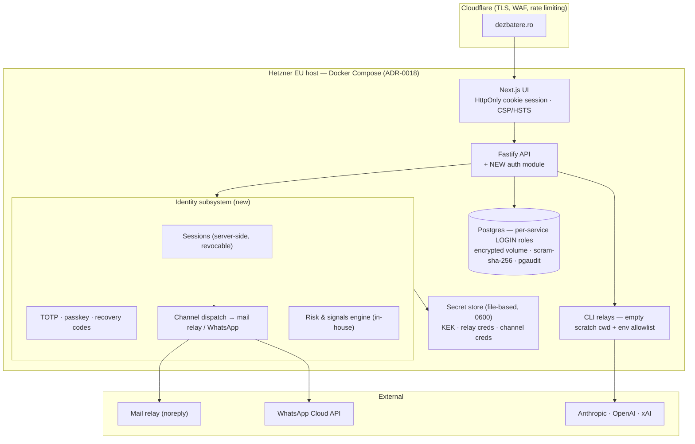
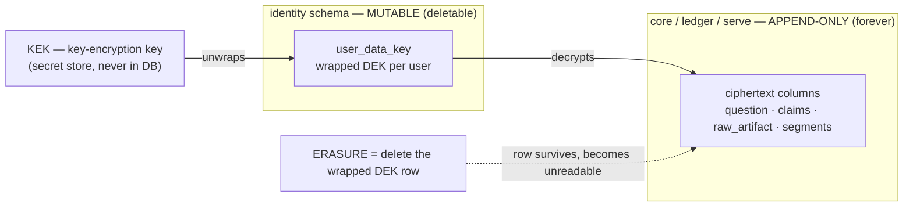

> ## ⚠ AMENDED 2026-08-19 — read this first
> This document was adversarially reviewed by a blind research seat and **took damage**. Corrections are in [`AMENDMENTS.md`](AMENDMENTS.md); the reasoning is in [`RESEARCH-CONCLUSIONS.md`](RESEARCH-CONCLUSIONS.md) and `research/RA|RB|RC`.
> **Where the original text below conflicts with an amendment, the amendment wins.** No V ruling changed.

# Wave 2 — Target Architecture and Specifications

**Mission:** Individual Accounts, Privacy-by-Design, and Secure Operations
**Target:** `dialectical-engine` — Fastify API, embedded/containerised Postgres, Next.js UI, CLI relays
**Produced:** 2026-08-18, on V's answers. Wave 1 (`wave-1-current-state.md`) is the evidence base; `2026-08-17-mfa-recovery-requirements/RESEARCH-REPORT.md` (three blind seats) is the requirements base for MFA/recovery/AI-support and is **consumed, not re-derived**.
**Risk tier:** `high` · **planning tier:** 2 (set at the MFA mission's H0 intake; the immutable high-risk floor fires on auth work and is never tierable down).

> **Legal posture:** no statement here is a compliance conclusion. Lawful bases, transfer mechanisms, and retention obligations are marked `UNVERIFIED — counsel` and collected in §24. The phrases "GDPR compliant", "end-to-end encrypted", "prompt-injection proof", and "anonymous" (for pseudonymised data) are avoided by rule.

---

## 0. The rulings this design is built on

| Ruling | V's decision |
|---|---|
| Launch shape (Q19) | **Private hosted → public later.** Registration-gated first |
| Jurisdiction (Q2) | **Global from day one** (MFA mission H0) |
| Audience (Q3/Q18) | **Adults only, 18+, consumer-facing** |
| Default visibility (Q4) | **Private by default**; publishing is deliberate, with an indexing warning |
| Erasure (Q12) | **Crypto-shredding.** Public debates remain; users may delete their own private debates at will |
| Retention (Q17) | **Public forever; private tied to the account**; inactive accounts warned then shredded |
| Auth build/buy (Q9) | **Build into the API.** Own signup, own noreply mailing, own WhatsApp code delivery, any authenticator app |
| **MFA shape** | **Factors = password + (TOTP *or* passkey). WhatsApp and email are recovery and alert channels, never factors** |
| Recovery (Q15) | **Recovery email demanded at registration**; last-resort path when WhatsApp, authenticator, and codes are all lost |
| Hosting (Q10/Q11) | **Hetzner + Cloudflare per ADR-0018**, EU region (free-tier alternatives noted in §12.6) |
| Question content (Q5/Q7) | **Prohibit personal data in questions; warn at the ask box** |
| Third-party names (H5) | **Drop `decision_owner`/`action_owner` from the user-facing ask** |
| Posture | **Defensive-only.** V's own product; no testing against third parties |
| `web/` duplicate UI | **Skipped for now** — remains an open decision (§25) |

---

## 9. Target architecture

### 9.1 The shape

**Everything new lives inside the existing service.** No new runtime, no identity vendor, no second datastore. Three additions: an `identity` Postgres schema, an auth module in the API, and a key-management layer that the write paths call before persisting user text.

### 9.2 The central design decision — how crypto-shredding actually works here

Wave 1 established the hard constraint: **77 of 79 tables physically refuse UPDATE and DELETE** (`core.reject_mutation()`), DR-188 forbids deletion, and **the user's question exists in nine places**, including verbatim echoes inside immutable model output. Erasure by deletion is impossible; erasure by overwriting is impossible.

**Therefore: content is encrypted at the moment of first write, and erasure destroys the key.**

- Each user gets a **Data Encryption Key (DEK)**, generated at registration, stored only **wrapped** by a **Key Encryption Key (KEK)** held in the secret store — never in the database.
- Every free-text carrier of user content is written **already encrypted** under the owning user's DEK. Because encryption happens at insert time, the append-only tables are never violated: the ciphertext is immutable, exactly as DR-188 requires.
- **Erasure = destroying the wrapped DEK**, a row in the *mutable* `identity` schema. The debate rows survive forever (DR-188 satisfied); their personal content becomes cryptographically irrecoverable (Art. 17 addressed — `UNVERIFIED — counsel` on sufficiency; §24).
- **Published debates are re-encrypted under a corpus key at publication**, not the user key. This is precisely V's ruling: publishing is the moment content leaves the user's private key envelope and joins the permanent public record. Deleting the account then shreds the private material and severs the pseudonym link, while the public debate stands.

**What this buys, in one sentence:** it is the only design in which "never delete anything" and "erase my data" are both true statements about the same system.

**What it costs, stated honestly:** every read of user content requires an unwrap; a lost KEK destroys everything (§12.5 covers escrow); ciphertext is not searchable, so any future full-text search over private debates needs a separate design; and content already stored in plaintext must be migrated (§23 in Wave 3).

### 9.3 Alternatives considered

| Option | Why not chosen |
|---|---|
| **Amend DR-188 to allow real DELETE** | Simplest to build, and V's answer to Q12 rejected it: the public record must survive. Also loses the append-only ledger's audit value, which is the product's core claim |
| **Tombstone + redaction only** (overwrite text with `[redacted]`) | Impossible without UPDATE, which the triggers forbid; would require dropping the immutability guarantees everywhere |
| **Per-debate keys instead of per-user** | Finer-grained, but a user's "delete everything" becomes an N-key ceremony with partial-failure states. Per-user is one atomic act; per-debate keys can be added later under the same wrapping scheme |
| **Encrypt everything under one global key** | No erasure capability at all — shredding it destroys the whole corpus |

---

## 10. Authentication, session, MFA, recovery, and account lifecycle

### 10.1 Factors (per V's ruling, backed by the 3/3-converged research)

| Element | Role | Notes |
|---|---|---|
| **Password** | First factor | argon2id, memory-hard. Minimum 8 chars per NIST, **no composition rules, no forced rotation**; screened against a breached-password list |
| **TOTP** | Second factor (default) | **Any authenticator app.** Pin SHA-1 / 6 digits / 30 s / 160-bit secret and offer no options — that is what makes "any app" work |
| **Passkey (WebAuthn)** | Second factor (alternative, and the recommended one) | The only phishing-resistant option. Offered at signup; **required for operator accounts** |
| **Recovery codes** | Recovery input | 10 single-use codes, shown once, **stored only as hashes** |
| **Verified email** | Identifier · alerts · issued recovery codes | **Not a factor** — NIST SP 800-63B-4 §3.1.3 forbids it. Permitted to carry issued codes with a 24-hour ceiling (§4.2.1.2) |
| **WhatsApp** | Alert + recovery channel | **Not a factor** — its OTP lands in an account itself recoverable by SMS. V's WhatsApp codes live here, where they are safe and useful |

MFA is **mandatory before the account is usable**. The research's strongest counter-argument is recorded: mandatory MFA suppresses signups — but with zero users today, this is the only window in which it is free, and it never reopens.

### 10.2 Sessions — replacing `asker_id = sha256(token)`

| Property | Design |
|---|---|
| Token | Opaque 256-bit random, **stored hashed** server-side in `identity.session` |
| Transport | `HttpOnly; Secure; SameSite=Lax` cookie set by the **server**. The localStorage token and the JS-written mirror cookie are removed |
| Lifetime | Sliding 14-day idle expiry, **absolute 90-day cap** |
| Revocation | Real: delete/expire the session row. Users see all active sessions and can revoke individually or all-at-once |
| Binding | Session records device fingerprint, ASN/geo, first-seen — feeds the risk engine |
| CSRF | Because auth moves to a cookie, **the accidental CSRF immunity Wave 1 found disappears**. Required: `SameSite=Lax` + an anti-CSRF token on state-changing routes + strict `Origin` checking |
| Step-up | Sensitive actions require **fresh re-authentication regardless of session age** — this is what turns a stolen cookie from takeover into read-only intrusion |

### 10.3 Recovery — tiered, with time as the adjudicator

Per SP 800-63B-4 §4.2.2.2, an AAL2 account requires **two recovery inputs by different methods**, or one input plus a bound authenticator, or repeated identity proofing.

| Case | Path | Wait |
|---|---|---|
| Lost device, codes intact | Password + one recovery code | Self-service, minutes |
| Lost device **and** codes, other signals strong | Issued email code + a second independent input (WhatsApp confirmation, recognised device, passkey on another device) | Short hold |
| **Lost everything but the recovery email** (V's Q15 case) | Issued code to the recovery address, then a **7–14 day freeze with notification on every channel ever bound**, cancellable instantly by any surviving-factor sign-in | 7–14 days |
| Lost the email too | Repeated identity proofing (§10.6) or no recovery | — |
| Suspected compromise (two claimants) | **Do not adjudicate.** Freeze, notify everyone, let time decide | — |

Three controls carry the weight, all 3/3-converged:
1. **The last surviving factor cannot be removed** for 24–72 hours — an attacker's first move is to remove your factors; make it structurally impossible.
2. **Notification fan-out to every previously known channel**, plus an in-product feed an inbox attacker cannot delete.
3. **Capability degradation after weak recovery** — a recovered account can read and create but **cannot publish, delete, export, or change contact details** for a probation period. This converts a *successful* social-engineering attack into a bounded, reversible one.

Durations above are **engineering judgement, not evidence** — no seat claimed a source for a specific number. They are register rows (§10.7), tunable without a code change.

### 10.4 Account lifecycle

Registration (email + password + recovery email + MFA enrolment + 18+ affirmation + pseudonym issued) → verification (both addresses, 24-hour links) → active → optional publication rights → deletion (private material shredded, public debates retained under the corpus key, pseudonym link severed) or dormancy (warned, then shredded per §19).

### 10.5 Pseudonyms

System-generated at registration (Reddit-style, two-word + discriminator), never derived from email or user id. The **pseudonym↔account mapping lives in `identity`, encrypted, and is severed on erasure** — that severance is what makes public debates survive deletion without identifying their author. Pseudonym stability across public debates is **OPEN (Q13)** — options in §25.

### 10.6 Identity proofing (if ever needed)

Per the research (3/3): **build the risk/signals engine in-house** — device recognition, ASN/geo history, account age, authentication history, recovery-code lifecycle, tier ladder, delay-and-notify, notification fan-out, capability degradation. **Do not build document or biometric verification**: it is an arms race against synthetic media, a face template is Art. 9 special-category data, and global document coverage is exactly what vendors sell. Buy it *if and when* the risk ladder demands it; not at launch.

### 10.7 New register rows (charter law 13 — auth constants are ruled, never hard-coded)

`sessionPolicy` (idle/absolute lifetimes, cookie flags) · `passwordPolicy` (argon2id params, minimum length, breach-screening) · `mfaPolicy` (TOTP parameters, passkey requirement per role, enrolment grace) · `recoveryPolicy` (freeze durations, code count/TTL, degradation window, last-factor lock) · `rateLimitPolicy` (per-route, per-IP, per-account) · `channelPolicy` (which channels carry what, and their ceilings). Each seeded with its ruling as `source_ref`, in a new sealed register version.

---

## 11. RBAC and object-ownership

**Roles at launch: three.** The catalog's eight are the growth map, not launch staffing — paper separation of duties with one operator is theatre.

| Role | Who | Grants |
|---|---|---|
| `anonymous` | Not signed in | Read published debates only |
| `user` | Registered, MFA-enrolled | Full rights over own debates; publish; export; delete own private debates; manage own account |
| `operator` | V | Deployment config, worker/model status, DSAR execution, audit review. **Passkey required.** |

Growth path (documented, unbuilt): `moderator`, `support`, `security_auditor`, `db_operator`. The `worker/service` identity already exists and is reused, not replaced.

**Ownership model.** `core.run` gains `owner_user_id` (FK to `identity.user`) beside the existing `asker_id`. Every downstream resource inherits ownership by joining to the run — **the seam Wave 1 proved already works**.

| Action | Rule |
|---|---|
| View private debate | `owner_user_id = session.user_id` |
| View published debate | Anyone, including anonymous |
| Create / regenerate | `user` + fresh session |
| Publish / unpublish | Owner + step-up + explicit warning |
| Delete own private debate | Owner + step-up (shreds its content key) |
| Export own data | Owner + step-up |
| Change contacts / factors | Owner + step-up + notification + cooling-off |
| Deployment config, worker view | `operator` only — **closes the Wave 1 finding that `/v1/deployment` is unscoped** |
| Dev evaluator routes | `operator` only + existing production refusal |
| Audit review | `operator` |

**Deny-by-default:** a shared `preHandler` replaces the 15 hand-rolled inline checks; a route with no declared policy **refuses**. `caller_scope` is taken **from the session, never from the request body** — closing the Wave 1 privilege-confusion seam. Every ownership rule gets an explicit IDOR/BOLA test per route (Wave 1 found coverage generalised by shared SQL rather than asserted per route).

---

## 12. Encryption and key management

### 12.1 Data classification

| Class | Examples | Treatment |
|---|---|---|
| **C1 Secret** | Password, TOTP seed, recovery codes, session token, KEK, relay/channel credentials | Never stored recoverable: argon2id (password, codes), **encrypted TOTP seed**, hashed session tokens, secret store for keys |
| **C2 Personal** | Email, recovery email, phone/WhatsApp number, pseudonym mapping, risk signals | Encrypted under the user DEK; email additionally **blind-indexed** (HMAC) so login lookup works without decryption |
| **C3 User content** | Question text, claims, restatements, raw artifacts, composed segments, investigations, aliases | Encrypted under the user DEK at insert; re-keyed to the corpus key on publication |
| **C4 Operational** | Ids, timestamps, hashes, scores, model/provider refs, register rows | Plaintext — needed for joins, ordering, and audit |

**Minimise first:** `decision_owner`/`action_owner` are removed (V's ruling); the phone number exists only if the user opts into WhatsApp alerts; no birthdate is collected (18+ is an affirmation, not a date).

### 12.2 Key hierarchy

`KEK` (secret store, file 0600, outside the DB) → wraps `user DEK` (per user, `identity.user_data_key`, **mutable — this is the shred point**) and `corpus key` (published content). Rotation: KEK rotation re-wraps DEKs without touching ciphertext; DEK rotation is unnecessary because shredding is the lifecycle end.

### 12.3 In transit
TLS everywhere including internal connections; Postgres `sslmode=verify-full` (Wave 1 found `disable`); HSTS at the edge.

### 12.4 At rest
Encrypted volume for the database; **encrypted backups**; the ciphertext-column design means even a stolen datadir yields no user content without the KEK — which is the strongest single improvement over today's fully plaintext posture.

### 12.5 The KEK's own survival
A lost KEK destroys every user's content. Required: KEK escrow in a sealed offline copy held by V, documented restore drill, and a **quarterly restore test** (Wave 1: zero restore tests exist today).

### 12.6 Hosting sizing, and the free-tier answer V asked for
ADR-0018 (Hetzner + Cloudflare) is ruled. **No external KMS at this scale** — a file-based secret store with strict permissions is proportionate for a single-operator EU host; KMS becomes justified when staff count exceeds one. Free alternatives that would work: **Oracle Cloud Free Tier** (4 ARM cores / 24 GB, EU regions, free indefinitely) runs the whole stack; Hetzner's ~€4–8/month buys better reliability. **Email is the one component where self-hosting reliably fails** (IP reputation, SPF/DKIM/DMARC, blocklists): keep templates and logic in-house, send through a relay (Brevo/Resend free tiers, or SES). **WhatsApp has no keyless path** — Meta's Cloud API requires a business account and token, so it needs an explicit **DR-179 carve-out** (§25).

---

## 13. Database access and audit

### 13.1 Access — replacing "connect as superuser"

Wave 1 found the app connects as the bootstrap superuser with a password hardcoded in tracked source, while ~40 well-designed least-privilege GRANTs target roles that are all `NOLOGIN` — **a correct privilege model, inert**. The work is activation, not design:

1. `ALTER ROLE … LOGIN PASSWORD` for `debateai_runtime`, `debateai_replay`, `debateai_settlement_watch`, and the evaluator roles; each service gets its **own** connection string.
2. **Stop connecting as the owner/superuser** anywhere in the app path.
3. `scram-sha-256` in `pg_hba.conf` (currently cleartext `password`), loopback/private-network only.
4. Credentials move from tracked source into the secret store.
5. **This also repairs append-only enforcement**: a superuser can `SET session_replication_role='replica'` and defeat every immutability trigger. A least-privilege role cannot.
6. **Block TRUNCATE** — Wave 1's gap G1: row triggers never fire on TRUNCATE. Add `BEFORE TRUNCATE … FOR EACH STATEMENT` triggers.
7. Human production access: SSH key + passkey-backed SSO where available, short-lived, justified, logged. With one operator this is **documented discipline plus break-glass alerting**, not dual control — and that residual risk is recorded, not disguised (§25).

**On the mission's "database 3FA":** it becomes *separate service identities + no shared credentials + least privilege + phishing-resistant human access + short-lived credentials + break-glass with alerting*. That is what the requirement means operationally; "three factors on a database" is not a thing Postgres implements.

### 13.2 Audit — a new tamper-evident trail

Wave 1: `Fastify({ logger: false })` — **no audit trail of anything**. The debate `ledger` cannot absorb auth events: its action-kind vocabulary is closed, organised by `run_id` (auth events have no run), and it is exposed on the asker-facing digest.

**Therefore a separate append-only `identity.audit_event` table**, protected by the same `core.reject_mutation()` trigger, with a **hash chain** (each row carries the previous row's digest) making silent deletion detectable.

Captured per the mission's §E: actor and identity type · session/request correlation id · action · target resource type and id · UTC timestamp · source context (IP, ASN, user agent) · authorization decision · success/failure · privileged-access justification.

**Never captured:** passwords, tokens, TOTP seeds, recovery codes, raw prompts, debate text, provider payloads, or any C2/C3 content. Auditable events: registration, verification, login success/failure, MFA enrol/verify/remove, session create/revoke, recovery start/advance/complete/cancel, contact change, publish/unpublish, deletion/shred, export, operator actions, DSAR steps. Retention and access rules in §19; off-host replication and alerting on anomaly.

Database-layer: enable `log_connections`, `log_disconnections`, and `pgaudit` for DDL and privileged statements.

---

## 14. LLM isolation and prompt-injection containment

CONT-01 shipped process containment (empty scratch cwd, PWD/OLDPWD rewrite, codex sandbox flags). Wave 1/S5 found what remains. **Extend, do not duplicate.**

**G1 — Environment and process.** Replace `{...process.env}` with an **explicit allowlist** (`HOME`, `PATH`, `TMPDIR`, `LANG`, vendor auth vars only) — today `DATABASE_URL` and `SSH_AUTH_SOCK` (a live agent socket) reach every model subprocess. Pass grok's **unused `--sandbox`** flag; add claude's `--setting-sources` and `--strict-mcp-config`. Add **SIGKILL escalation** after SIGTERM (today a SIGTERM-ignoring child hangs the relay forever), a stdout byte cap, and a request-size cap. **Authenticate the relay endpoint** — it is currently unauthenticated on loopback, so any local process can spend V's model budget. Move the acceptance DB password out of tracked source.

**G2 — Instruction/data separation.** Stop flattening roles into an unescaped `[role]` argv string (`acceptance/relay-core.ts:59-64`) — untrusted text containing `\n\n[system]\n` forges a system turn. Either escape the marker or preserve structure. Wrap all untrusted text in explicit escaped delimiters on the judge and review paths (which today use raw interpolation). Add **runtime length and control-byte caps** on `question_line` and model `statement` — today only one 4 KB cap exists anywhere.

**G3 — Assert, then adversarially test.** Exact-argv pins for claude and grok (only codex has one); an **env-absence assertion** (no test checks that a secret is absent from the child's environment); a SIGTERM-ignoring-child test; and **wire `acceptance/vitest.config.ts` into the default test run** — the containment tests currently only run when invoked by hand. The adversarial injection corpus is **designed here, built only on V's per-phase greenlight**, and is a self-test of V's own product.

**Blast radius after this work:** an injection can still corrupt debate content and poison a review verdict — that is inherent to LLM adjudication and is disclosed, not promised away. What it can no longer do is reach secrets, the database, another user's data, or the operator's SSH agent. **Stated as containment, never as prevention.**

---

## 15. Public debate, pseudonymity, and deletion semantics

Private by default. Publishing requires an affirmative action and a plain warning that content becomes publicly readable and may be indexed. At publication, content is **re-encrypted under the corpus key** — the technical expression of V's ruling that public debates outlive the account.

| Event | Private debates | Published debates |
|---|---|---|
| User deletes one debate | Content key shredded; rows remain | Not applicable (must unpublish first — **`UNVERIFIED — counsel` whether unpublish-then-delete must be permitted**) |
| User deletes account | All private content shredded | **Remain**, author link severed, attributed to a retired pseudonym |
| Dormancy | Shredded after the warned period | Remain |

Moderation, reporting, blocking, and appeals are **Phase 6**, designed but unbuilt — but visibility and deletion semantics are defined **now**, because the privacy centre depends on them (charter design-order constraint).

---

## 16. Privacy centre and DSAR workflow

Sized to one operator. The user-facing centre shows: account and profile data; security state (factors enrolled, active sessions, recent security events — no secrets); their debates with visibility state; consent/notice history; **export** (machine-readable JSON of everything under their key); **correction**; **delete a private debate**; **delete the account**; restriction/objection requests; and contact/complaint routes.

DSAR operations: identity verification proportional to risk (an authenticated session is the strongest proof; unauthenticated requests use the recovery ladder); receipt and **one-month deadline tracking with a documented two-month extension** for complex requests; legal-hold review; search across the database, audit trail, backups, and vendors; machine-readable export; **shred evidence** (the audit event recording which key was destroyed and when — the proof of erasure, without duplicating personal data); and processor notification. With one operator, **dual control is not available and is recorded as residual risk**, not simulated.

---

## 17. Cookies and consent

Wave 1's inventory is complete and tiny: **one auth credential, zero analytics, zero third-party origins**, with fonts self-hosted at build time. Target: **one `HttpOnly; Secure; SameSite=Lax` session cookie plus one CSRF token** — both strictly necessary, therefore **consent-exempt under ePrivacy Art. 5(3)** (`UNVERIFIED — counsel`).

**Therefore: an informational cookie notice, not a consent banner.** A banner where nothing needs consent is dark-pattern theatre. If analytics are ever added (Q14 open), the banner arrives with them: accept/reject/granular at equal prominence, version and timestamp recorded, withdrawal as easy as acceptance, nothing non-essential firing before consent.

---

## 18. Vendors, transfers, and subprocessors

| Vendor | Data received | Role | Transfer | Status |
|---|---|---|---|---|
| **Anthropic / OpenAI / xAI** (via local CLIs) | Question text + local debate context | Processor (likely) | Third-country — mechanism `BLOCKED` pending Q6/Q7 | **Q7 unanswered: retention/training unknown.** Mitigation: questions prohibit personal data (V's ruling) + warning at the box |
| **Hetzner** | All hosted data | Processor | EU — no transfer | DPA required |
| **Cloudflare** | All traffic metadata, TLS termination | Processor | Third-country, DPF/SCC assessment | DPA required |
| **Mail relay** (Brevo/Resend/SES) | Email address, message content | Processor | Depends on choice | DPA + region check |
| **WhatsApp / Meta** | Phone number, message metadata | Processor | Third-country | DPA + TIA + **DR-179 carve-out** |

**DPO / EU representative: not assumed either way** — the determination depends on scale and processing nature and is a counsel item (§24). No vendor row is invented: this table lists only what is in use or ruled.

---

## 19. Retention and deletion propagation

| Data | Retention |
|---|---|
| Published debates | **Forever** (V's ruling; DR-188) |
| Private debates | **Life of the account**; user-deletable at will |
| Account | Until deleted or dormant past the warned period |
| Audit events | Fixed period (proposed 24 months), then key-shredded; security-incident records held longer under documented legal hold |
| Session records | Expire with the session; retained briefly for the "your sessions" view |
| Risk signals | Rolling window (proposed 12 months) |
| Backups | Encrypted; **shredding propagates by key destruction**, since backups contain ciphertext only — a genuine advantage of this design |
| Vendor-side | `UNKNOWN` pending Q7; users are warned instead of promised |

Deletion propagation is **key-centric**: one key destroyed makes every copy — live rows, backups, replicas — unreadable at once. That is what makes propagation tractable in an append-only world.

---

## 20. Incident response and breach notification

Detection (audit anomalies, failed-login spikes, break-glass alerts, relay anomalies) → triage → containment (revoke sessions, freeze accounts, rotate KEK, disable channels) → assessment against the 72-hour authority-notification clock and the "high risk to rights and freedoms" test for individual notification (`UNVERIFIED — counsel`) → notification → post-incident record. With one operator, the plan is a **runbook with pre-written templates**, not a staffed rota — and that is stated plainly.

**Live item:** the Wave 1 exposure (a public datadir on GitHub) is the first case this process must retroactively cover — see §25.

---

## 24. Legal-counsel review list

1. Whether crypto-shredding satisfies Art. 17 erasure (the central question of this design).
2. Whether retaining published debates after account deletion is lawful, and on what basis.
3. Lawful basis per processing activity — **not consent by default**.
4. Whether prohibiting personal data in questions is sufficient, given users will submit it anyway.
5. Transfer mechanisms for each vendor actually used (§18).
6. Whether a DPO or EU representative is required.
7. DPIA screening — likely indicated (systematic processing, global scope, AI processing of user content).
8. Age-assurance adequacy for an 18+ declared restriction.
9. Special-category data appearing incidentally in debate questions (politics, religion, health are debate topics).
10. Third-party personal data inside questions — Art. 14 duties toward people who never used the service.
11. Recovery-email as last-resort proof — adequacy under the applicable standard.
12. WhatsApp/Meta processing of phone numbers for alerts.
13. Retention periods proposed in §19.
14. Breach-notification thresholds for the existing GitHub exposure.
15. Terms and acceptable-use drafting, incl. the 18+ restriction and the no-personal-data rule.
16. DSA applicability if public participation opens (distinct from GDPR — charter law 7).

---

## 25. Residual-risk register

| # | Risk | After this design | Owner decision |
|---|---|---|---|
| R1 | **The GitHub exposure** — contained going forward, but the data remains in pushed history | Repo privacy + history purge are **V's calls**; clones cannot be recalled | **OPEN** |
| R2 | **Single operator** — no dual control for DSARs, break-glass, or production access | Compensated by audit trail and alerting; **not eliminated** | Accepted, documented |
| R3 | **KEK loss destroys everything** | Escrow + quarterly restore drill | Requires discipline |
| R4 | **Injection can still corrupt debate content and pass its own review** | Contained (no secrets, no DB, no cross-user reach); **not prevented** | Inherent; disclose |
| R5 | **WhatsApp requires a Meta API token** | Needs an explicit DR-179 carve-out | **OPEN** |
| R6 | **Recovery email is a concentration point** — whoever owns the mailbox can start recovery | Mitigated by freeze + fan-out + capability degradation, never removed | Accepted per Q15 |
| R7 | **Ciphertext is not searchable** | Private-debate search needs a separate design | Deferred |
| R8 | **The `web/` duplicate UI** — unhardened, and what the root build builds | **Skipped by V for now** | **OPEN** |
| R9 | **Vendor retention unknown (Q7)** | Users warned; questions prohibit personal data | **OPEN** |
| R10 | **Pseudonym stability (Q13) undecided** | Affects linkability across public debates | **OPEN** |
| R11 | **Legal entity (Q1) unknown** | Controller identity, notices, and DPAs all block on it | **OPEN** |
| R12 | **Analytics (Q14) undecided** | Determines whether a consent banner is ever needed | **OPEN** |
| R13 | **Plaintext already in the database** | Migration must encrypt or shred existing rows (Wave 3) | Planned |

---

## Wave 2 stop

Target architecture, specifications, and the residual-risk register are complete on the answers given. Branches that remain `BLOCKED` are marked as such with alternatives, never with a fake chosen design (charter law 4). **Wave 3 (Phase-1 roadmap, test strategy, migration and runbook) opens on V's acceptance of this document.**
