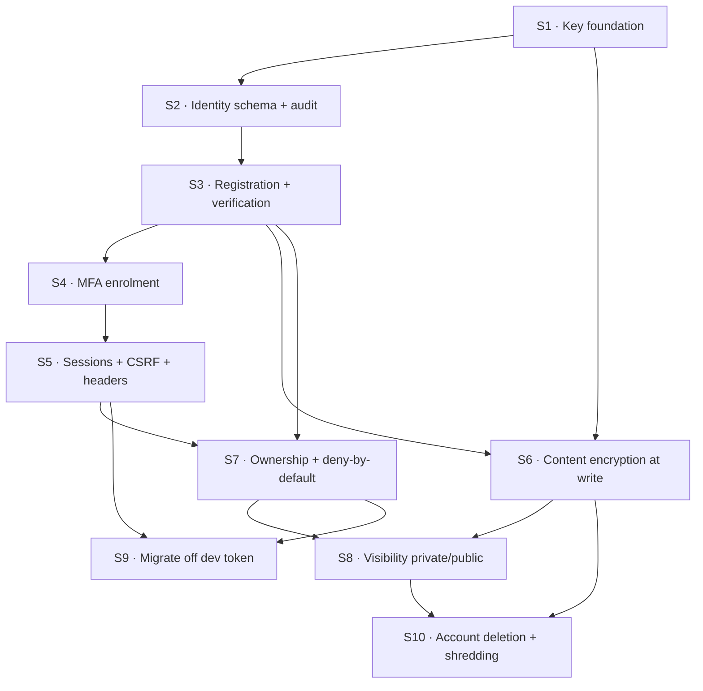
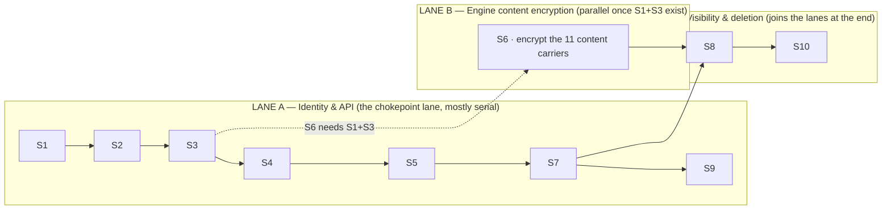
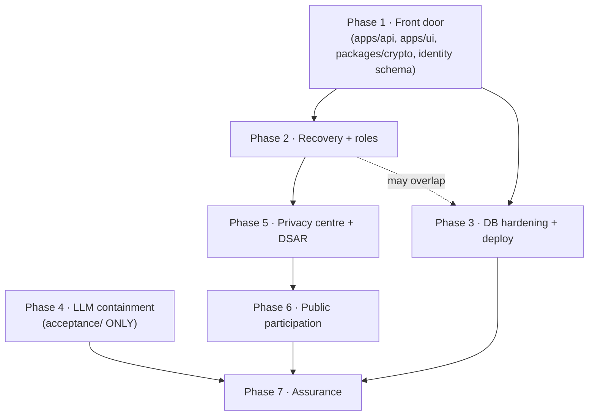

> ## ⚠ AMENDED 2026-08-19 — read this first
> This document was adversarially reviewed by a blind research seat and **took damage**. Corrections are in [`AMENDMENTS.md`](AMENDMENTS.md); the reasoning is in [`RESEARCH-CONCLUSIONS.md`](RESEARCH-CONCLUSIONS.md) and `research/RA|RB|RC`.
> **Where the original text below conflicts with an amendment, the amendment wins.** No V ruling changed.

# Wave 4 — Execution Topology, Dependency Chain & Parallelism Plan

**Mission:** Individual Accounts, Privacy-by-Design, and Secure Operations
**Basis:** Waves 1–3 + the MFA/recovery 3-seat research. **Purpose:** turn the roadmap into a runnable schedule — what can execute in *true* parallel, and what only *looks* parallel until you check which files it touches.
**Produced:** 2026-08-19 · planning only, no product code.

---

## 0. First, the vocabulary — because "wave" and "phase" are not the same thing

This matters, because the question "don't we have a Wave 4?" only answers cleanly once the two axes are separated:

- **Waves are PLANNING passes.** Wave 1 = current state, Wave 2 = architecture, Wave 3 = Phase-1 roadmap, **Wave 4 (this) = execution topology**. Waves are sequential by nature — each consumes the last. They are documents, not build work.
- **Phases are BUILD stages.** Phase 0 (planning, = the waves) → Phase 1 (the front door) → … → Phase 7 (assurance). Phases are where parallelism lives.

So there is no "Wave 5" coming — Wave 4 is the last planning pass. After it, the work is **phases**, and this document is the map of which phases, and which slices *inside* a phase, can run at the same time.

**Are Waves 2 and 3 "done" (research + architecture)?** Yes, and here is the honest basis:
- **Research** for the whole mission was done once, in Wave 1 (five parallel sweeps `S1–S5`) plus the MFA/recovery mission (three blind seats). Waves 2 and 3 **consumed** that research rather than re-running it — the right move, because re-researching a settled current state wastes tokens and invites drift. No new discovery was needed; every Wave 2/3 claim traces to a Wave 1 citation or a research-report finding.
- **Architecture** is Wave 2 (target design + 13 residual risks) and Wave 3 (ten implementable slices). Both are complete to the charter's slice contract.

If at any point you want an **adversarial review** of the Wave 2 architecture (a red-team of the crypto-shredding design specifically), that is a distinct, worthwhile pass — say the word and it becomes its own board lane. It is not a gap in "is it done"; it is a confidence upgrade.

---

## 1. The two graphs that decide real parallelism

Naive parallelism reads only the **logical dependency** graph ("S4 needs S3"). True parallelism needs a second graph on top: the **file-contention** graph ("S4 and S5 both edit `apps/api/src/index.ts`, so they cannot merge cleanly at the same time"). A pair of slices runs in true parallel **only if they are independent in *both* graphs.**

### 1.1 Logical dependency DAG (Phase 1)

**Longest logical chain (the critical path):** `S1 → S2 → S3 → S4 → S5 → S7 → S8 → S10` — **eight deep**. Nothing makes Phase 1 shorter than this chain, no matter how many agents you throw at it.

### 1.2 File-contention matrix (the constraint everyone forgets)

The API entry file is edited by **seven of ten slices**. That single fact, not the logical graph, is what actually serializes Phase 1.

| File | S1 | S2 | S3 | S4 | S5 | S6 | S7 | S8 | S9 | S10 |
|---|---|---|---|---|---|---|---|---|---|---|
| `apps/api/src/index.ts` **(chokepoint)** | | | ✎ | ✎ | ✎ | | ✎ | ✎ | ✎ | ✎ |
| `packages/contract/src/index.ts` | | | ✎ | | ✎ | | ✎ | | | |
| `packages/contract/src/client.ts` | | | | | ✎ | | | | ✎ | |
| `apps/ui/lib/api.ts` | | | ✎ | | ✎ | | | | ✎ | |
| `apps/ui/components/AuthGate.tsx` | | | | | ✎ | | | | ✎ | |
| `packages/db/src/schema.ts` + `index.ts` | | ✎ | | | | ✎ | ✎ | ✎ | | |
| `packages/serve/src/index.ts` | | | | | | ✎ | ✎ | ✎ | | ✎ |
| `packages/memory/src/index.ts` | | | | | | ✎ | ✎ | | | |
| `packages/ledger/src/index.ts` | | | | | | ✎ | | | | |
| `apps/runner/src/index.ts` | | | | | | ✎ | | | | |
| `packages/judgement/src/index.ts` | | | | | | ✎ | | | | |
| `packages/register/src/*` | ✎ | | | ✎ | | | | | | |
| `acceptance/*` | ✎ | | | | | | | | ✎ | |
| **NEW** `packages/crypto/` | ✎ | | | ✎ | | ✎ | | | | ✎ |
| **NEW** `migrations/00NN.sql` | | ✎ | | | | ✎ | ✎ | ✎ | | |
| **NEW** `tests/security/` | | | | | ✎ | | ✎ | | | |

✎ = the slice edits (or creates) that file.

**Reading it:** migrations are *new* files per slice (additive, DR-188) → **no contention**. The genuine contention clusters are two: the **API cluster** (`apps/api/src/index.ts` + contract + UI api) touched by S3/S4/S5/S7/S8/S9/S10, and the **engine-internals cluster** (`packages/serve` + `memory` + `ledger` + `runner` + `judgement`) touched mostly by S6, with S7/S8/S10 reaching into `serve`.

### 1.3 The finding you asked for: what is *truly* parallel

Overlay both graphs and Phase 1 collapses into **two lanes that barely touch**:

- **Lane A is essentially serial** — not because of logic alone, but because every slice in it edits `apps/api/src/index.ts`. Two agents editing that file in parallel worktrees produce a merge conflict every time.
- **Lane B (S6) is the one genuine parallel win inside Phase 1.** It touches engine-internals files (`ledger`, `runner`, `judgement`, `memory`, `db`) that Lane A never opens. It can start the moment S1 and S3 exist and run **alongside S4→S5→S7**, overlapping Lane A only in `packages/serve` (coordinated at S6/S7/S8 merge).
- **Lane C (S8→S10) is the join** — it needs both lanes complete, so it is the tail, not a parallel opportunity.

**Practical schedule (agent-lanes over time):**

| Step | Lane A | Lane B | Notes |
|---|---|---|---|
| 1 | **S1** | — | root; nothing parallel yet |
| 2 | **S2** | — | |
| 3 | **S3** | — | |
| 4 | **S4** | **S6 starts** | first true parallelism |
| 5 | **S5** | S6 continues | |
| 6 | **S7** | S6 lands → merge into `serve` | coordinate the `serve` merge |
| 7 | **S9** | **S8** | S8 needs S6+S7 done |
| 8 | — | **S10** | the tail |

So Phase 1's floor is the eight-deep critical path, and the only slice that meaningfully overlaps it is S6. **Everything else is sequential — and that is a property of the codebase, not of the plan.**

---

## 2. The efficiency unlock you explicitly asked for

The chokepoint is `apps/api/src/index.ts` — one 311-line file where all fifteen routes are registered inline (Wave 1 found "every route re-implements the same inline check; zero Fastify hooks"). **That file is why Lane A can't parallelize.**

**Enabling slice S0 (optional, recommended): split the API into per-domain route modules.** `apps/api/src/routes/auth.ts`, `.../account.ts`, `.../debates.ts`, `.../deployment.ts`, `.../events.ts`, each registered by a one-line `app.register()` in `index.ts`. Then:

- S3 edits `routes/auth.ts`, S7 edits `routes/deployment.ts` + a shared `preHandler`, S8 edits `routes/debates.ts`, S10 edits `routes/account.ts` — **different files, no contention.**
- The shared deny-by-default `preHandler` (S7) becomes the *only* coordinated edit, and it is small.

**Cost/benefit:** S0 is ~S-sized and touches only `apps/api/`. It converts Lane A from "seven slices fighting over one file" into "seven slices in their own files behind one hook." If you intend to run more than one coding agent, **S0 pays for itself immediately**; with a single agent it is still worth it for review clarity, but not urgent. **This is a product decision — your call at loop-open.**

---

## 3. Program-level topology (the whole mission, not just Phase 1)

Across phases, the parallelism story is much better than inside Phase 1, because whole phases touch disjoint trees:

- **Phase 4 (LLM containment) is fully independent of everything** — it edits only `acceptance/`, which no other phase opens. **It can run start-to-finish in parallel with the entire identity programme.** This is the cleanest parallel lane in the mission and the natural home for a second board.
- **Phase 3 (DB hardening + deploy)** is deployment-shaped and can overlap Phase 2 once Phase 1's roles land.
- **Phases 5→6→7** are a serial tail: erasure workflows need visibility semantics (P1), public participation needs the private core (P5), assurance closes everything.
- **Critical program path:** `P1 → P2 → P5 → P6 → P7`. Phase 4 hangs off the side; Phase 3 is a short parallel spur.

---

## 4. Complete file plan (create vs edit) — for maximum-efficiency lane assignment

Every path is evidenced in-tree (charter law 12: no invented paths). "NEW" = created; the rest = edited.

### 4.1 Files CREATED

| File | Slice | Purpose |
|---|---|---|
| `packages/crypto/` (new package: `src/index.ts`, `package.json`, `tsconfig.json`) | S1 | wrap/unwrap, TOTP, shred |
| `migrations/0030_identity_foundation.sql` | S2 | `identity` schema + audit table |
| `migrations/0031_run_ownership.sql` | S7 | `core.run.owner_user_id` |
| `migrations/0032_run_visibility.sql` | S8 | `core.run.visibility` |
| `migrations/0033_content_ciphertext.sql` (if companion columns chosen) | S6 | ciphertext carriers |
| `apps/api/src/channels/mail.ts` (new module) | S3 | noreply mail dispatch |
| `apps/api/src/channels/whatsapp.ts` (new module) | S3/S4 | WhatsApp code delivery |
| `apps/ui/app/register/page.tsx` + verification pages | S3 | signup UI |
| `apps/ui/app/settings/security/` (MFA enrol + sessions) | S4/S5 | factor + session UI |
| `apps/ui/app/settings/account/` (delete flow) | S10 | account deletion UI |
| `tests/security/` (new suite dir) | S5/S7 | enumeration, CSRF, IDOR/BOLA, headers, shred |
| `apps/api/src/routes/*.ts` (**only if S0 taken**) | S0 | per-domain route modules |

### 4.2 Files EDITED (contention noted)

| File | Slices | Contention risk |
|---|---|---|
| `apps/api/src/index.ts` | S3,S4,S5,S7,S8,S9,S10 | **HIGH — the chokepoint. S0 dissolves it** |
| `packages/serve/src/index.ts` | S6,S7,S8,S10 | **MED — coordinate the merge order** |
| `packages/contract/src/index.ts` (+ `contractInventory`) | S3,S5,S7 | MED |
| `packages/db/src/schema.ts` + `src/index.ts` | S2,S6,S7 | MED (note Wave 1 G0: mirror is partial) |
| `packages/memory/src/index.ts` | S6,S7 | LOW |
| `apps/ui/lib/api.ts` | S5,S9 | LOW |
| `apps/ui/components/AuthGate.tsx` | S5,S9 | LOW |
| `packages/contract/src/client.ts` | S5,S9 | LOW |
| `packages/ledger/src/index.ts` | S6 | none |
| `apps/runner/src/index.ts` | S6 | none |
| `packages/judgement/src/index.ts` | S6 | none |
| `apps/ui/next.config.mjs` | S5 | none (headers) |
| `apps/ui/app/api/[...path]/route.ts` | S5 | none (stop forwarding Cookie) |
| `packages/register/src/runtime-environment.ts` | S1 | none |
| `packages/register/src/index.ts` (policy readers) | S4 | none |
| `acceptance/run-acceptance.ts` | S9 | none (service credential) |
| `acceptance/ceremony.test.ts` | S9 | none |
| `tests/unit/api.test.ts` (**invert :557-561**) | S5 | none |
| root `vitest.config.ts` (wire in acceptance suite) | Phase-1 infra | none |

**Lane-assignment rule for coding agents:** never put two agents on files sharing a HIGH or MED cell in the same window. In practice: **one agent owns Lane A (the API cluster) end to end; a second owns Lane B (S6, engine internals); a third can own Phase 4 (`acceptance/`) from day one.** That is the true concurrency ceiling for this mission — **three lanes**, not ten.

---

## 5. Kanban boards on 9119

Per the spine, there is **one dashboard, always on port 9119** (never overridden), serving **multiple named boards**. Your instinct — a board per independent unit — maps cleanly onto that once we use *phases*, not *waves*, as the unit (waves are sequential planning; they don't parallelize):

| Board slug | Scope | Why its own board |
|---|---|---|
| `accounts-phase1` | The ten Phase-1 slices (+ optional S0) | The active work; tickets carry the dependency edges so the **unblocked frontier = the parallel-runnable set** |
| `accounts-phase4` | LLM containment (`acceptance/` only) | **Genuinely independent** — can run start-to-finish alongside Phase 1 |
| (later) `accounts-phase2`, `-phase3`, … | Opened when their predecessor lands | Not created yet — no false "ready" signal |

The existing wayfinder map (`t_e227ee30` on board `dialectical-engine`) stays the mission index. Phase boards are where execution tickets live. **This document creates `accounts-phase1` with all ten slices and their blocking edges**, so the moment the coding loop opens, the board *shows* what can start — no re-derivation.

---

## 6. What opens the coding loop

1. V accepts Waves 2–4.
2. V rules the **§0.1 phase-order amendment** (encryption + MFA into Phase 1 — the one change that cannot be made later).
3. V decides **S0** (the API split — the efficiency unlock).
4. The **loop-ownership election** seats the fleet (which model owns coding, which owns review) — ticket `[model]` tags fill in from the roster.
5. Boards go live; Lane A / Lane B / Phase 4 dispatch in parallel per §4.2.

Until then this is planning: no product code, no merges, nothing on `main`.

---

## Wave 4 stop

The mission now has a complete planning stack: **what exists** (W1), **what to build** (W2), **in what order** (W3), and **what can run at once** (W4). The dependency chain is explicit, the true-parallelism ceiling is three lanes, the file plan is contention-annotated, and the boards are structured. Planning is complete; the next action is V's acceptance and the loop-ownership election.
