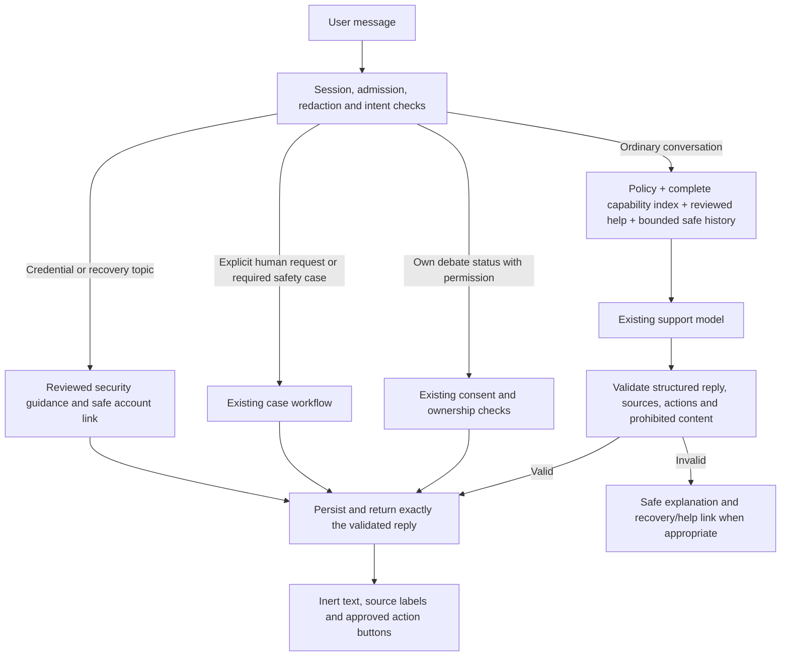

# Support Agent audit and proposed design

Date: 14 September 2026. Scope: current local source, read-only investigation, local tests and synthetic probes. The user selected **audit and implementation plan only**. This document does not claim the deployed service was tested or changed. **User clarification: an existing “Forgot password” flow must be reused whenever that intent is raised.** Its exact destination has not yet been located in this checkout; that is a source/deployment discrepancy to resolve, not authorization to build a replacement.

## Assessment

The Support Agent already has an LLM adapter, encrypted conversations, a reviewed English/Romanian help corpus, incident answers, consented access to the signed-in user's debate status, and human case handling. Its main problem is the logic surrounding the LLM. A twelve-topic regular-expression gate prevents ordinary questions from reaching it, the model receives no conversation history, and the corpus omits much of the current interface. Adding more canned questions would preserve the same failure mode.

The recommended change is a conversational support assistant supplied with a complete, reviewed map of product capabilities and safe navigation destinations. It should explain, clarify, remember the current support conversation, and acknowledge greetings and frustration naturally. Product claims must remain grounded in approved product knowledge. Credential operations remain outside its authority.

**Account recovery is navigation, not an assistant action.** The assistant may explain where the recovery interface lives. It must never generate, retrieve, request, validate or echo passwords, verification codes, OTPs, TOTP values, recovery codes, reset tokens, authenticator secrets or session credentials. It must never claim it reset a password or changed an account.

“Normal LLM” is interpreted here as normal conversational behavior in a product-support role: useful follow-ups, explanations and clarification, including small talk. Unrelated general-purpose research and arbitrary account or debate execution are outside this proposed change. That scope avoids turning support into an unrestricted second product.

## Evidence and limits

- Baseline: git HEAD `dbb47639`, branch `integration/debate-tiers`, with substantial pre-existing uncommitted work. Findings describe the inspected working tree, including visible local feature work; they are not a production release certification.
- All eleven Next.js page routes were inventoried, with account and debate flows inspected independently. The route/capability companion identifies active UI, restricted pages, absent routes and stale knowledge.
- The corpus loader reports **12 bilingual topics / 24 files**, no ignored topics, and KB hash `9016371b38ca10c594e7209c34e51ffd6c4a9b883c47f7b87e70c9881b2b1eec`. English article bodies total only **2,600 code points**.
- **432 existing tests passed in 6 files**: classifier, model boundary, KB loader, templates, escalation, and Help UI rendering. This establishes the current baseline, not readiness for the proposed behavior.
- A separate probe exercised the actual classifier and answer service with 23 prompts, a three-turn follow-up, and one deliberately invalid model completion. It used an in-memory redacting message port and a synthetic model; it made no real model, database, authentication or account calls.
- Production availability, actual relay quality/latency, real user deflection and satisfaction were not measured. Full integration/database tests and a live-model quality evaluation were not run.

Evidence: [probe results](/Users/vladmihaimiron/Documents/DebateAIRO/dialectical-engine/docs/superpowers/research/support-agent-evidence-2026-09-14/probe-results.json), [reproduction script](/Users/vladmihaimiron/Documents/DebateAIRO/dialectical-engine/docs/superpowers/research/support-agent-evidence-2026-09-14/probe.mts), [test output](/Users/vladmihaimiron/Documents/DebateAIRO/dialectical-engine/docs/superpowers/research/support-agent-evidence-2026-09-14/test-output.txt).

## Findings

### 1. Relevant knowledge is discarded unless a predefined phrase matches

In `retrieve`, lexical overlap contributes nothing unless a hard-coded intent regex also matches. An article added under a new ID has no intent regex and is therefore unreachable even when the question repeats its title. Zero results return `NO_SOURCE` before invoking the model. This is the direct cause of the FAQ-like behavior.

Source: [answer.ts:25](/Users/vladmihaimiron/Documents/DebateAIRO/dialectical-engine/apps/api/src/support/answer.ts:25), [scoring gate:90](/Users/vladmihaimiron/Documents/DebateAIRO/dialectical-engine/apps/api/src/support/answer.ts:90), [no-source branch:162](/Users/vladmihaimiron/Documents/DebateAIRO/dialectical-engine/apps/api/src/support/answer.ts:162).

| Local probe | Current result | Needed behavior |
|---|---|---|
| How do I start my first debate? | LLM called; `ANSWER_GROUNDED` | Explain the actual creation interface |
| How do I create a debate? | No model call; `NO_SOURCE` | Same intent, naturally understood |
| Where can I ask a question? | `NO_SOURCE` | Explain the composer and link to it |
| Can I share my results with a friend? | `NO_SOURCE` | Explain publishing and its prerequisites |
| How do I export the answer? | `NO_SOURCE` | Explain available answer export |
| What can I do in this app? | `NO_SOURCE` | Summarize the capability map |
| Hi! / Thanks, that helps. | `NO_SOURCE` | Normal greeting / acknowledgement |
| Cum creez o dezbatere? | `NO_SOURCE`, Romanian detected | Romanian creation guidance |

These are diagnostic examples, not a representative accuracy percentage.

### 2. The conversation shown on screen is not the model's conversation

The answer service passes exactly one user message to `SupportModelPort.complete`. Its own `listSession` port is never used for context. The route reads earlier outcomes for escalation, and the browser stores the visible transcript, but neither gives the answer model earlier exchanges.

The follow-up probe called the model for publishing and unpublishing in the same session; each call still had one user message. “Where is that button?” then returned `NO_SOURCE`.

Source: [answer.ts:203](/Users/vladmihaimiron/Documents/DebateAIRO/dialectical-engine/apps/api/src/support/answer.ts:203), [escalation history:391](/Users/vladmihaimiron/Documents/DebateAIRO/dialectical-engine/apps/api/src/support/index.ts:391), [browser transcript:335](/Users/vladmihaimiron/Documents/DebateAIRO/dialectical-engine/apps/ui/components/support/Assistant.tsx:335).

### 3. Suggested topics promise answers the current system cannot give

Of the six help-topic prompts, the probe reached the model for getting started and unpublishing. Reading condition marks, scores/reviews/verdicts and support privacy returned `NO_SOURCE`; account/MFA/session guidance triggered `REFUSE_ZONE`. The topic counts total 46 but are hard-coded, while the loader has 12 topics. The “Report a bug in this debate” suggestion also misses the retrieval gate.

Source: [HELP_TOPICS:105](/Users/vladmihaimiron/Documents/DebateAIRO/dialectical-engine/apps/ui/components/support/Assistant.tsx:105), [suggestion rendering:690](/Users/vladmihaimiron/Documents/DebateAIRO/dialectical-engine/apps/ui/components/support/Assistant.tsx:690).

Two `NO_SOURCE` outcomes anywhere in the evaluated session outcomes trigger escalation predicate E6. Thus normal greetings, rephrasings and follow-ups can themselves cause avoidable human cases. This is a code-level mechanism; the audit has not measured its production frequency.

Source: [escalation.ts:57](/Users/vladmihaimiron/Documents/DebateAIRO/dialectical-engine/apps/api/src/support/escalation.ts:57).

### 4. Account restrictions conflate safe explanation with credential handling

The classifier refuses sign-in, account creation, session management and account-security terms, even when the user only asks where to go. “I forgot my password” maps to `/settings`, an authenticated page; “Where is account recovery?” maps to `/login`. The uniform refusal says it cannot help even with account recovery. This is broader than the user's desired boundary.

Retain the inability to perform security actions. Replace broad topic refusals with concise, accurate navigation guidance and explicit limits on codes and resets. Do not invent `/forgot-password`, `/reset-password` or `/account/recovery`.

**The owner confirms that “Forgot password” already exists.** The inspected checkout does not reveal its entry point. Its `/login` first requires email and password; only then does “Use a recovery code” offer a saved MFA recovery code instead of an authenticator code. That is a different workflow. The inspected `/settings` has no password reset/change, email-change or active-MFA-regeneration control. The repository has `POST /v1/auth/recovery/start` and request persistence, but this audit did not locate the owner-referenced recovery UI or its complete delivery/completion path. Do not expose that API URL as a webpage or assume it is the intended control.

The implementation must connect the chatbot's `forgot-password` navigation action to the **existing** Forgot password flow, once its exact route or UI opener is verified. Do not substitute `/settings`, the saved-MFA-code control, a guessed new recovery URL or automatic human escalation. Do not tell users the feature is absent on the strength of this checkout discrepancy. The assistant opens or links to the account flow; it does not submit a reset request, collect credentials, or issue codes. Resolving the destination is the first implementation integration check.

Source: [login credentials and MFA:62](/Users/vladmihaimiron/Documents/DebateAIRO/dialectical-engine/apps/ui/components/LoginFlow.tsx:62), [saved recovery code control:296](/Users/vladmihaimiron/Documents/DebateAIRO/dialectical-engine/apps/ui/components/LoginFlow.tsx:296), [recovery-start API:821](/Users/vladmihaimiron/Documents/DebateAIRO/dialectical-engine/apps/api/src/index.ts:821), [recovery service:64](/Users/vladmihaimiron/Documents/DebateAIRO/dialectical-engine/apps/api/src/recovery.ts:64), [request persistence:64](/Users/vladmihaimiron/Documents/DebateAIRO/dialectical-engine/packages/db/src/recovery.ts:64).

Source: [classify.ts:24](/Users/vladmihaimiron/Documents/DebateAIRO/dialectical-engine/apps/api/src/support/classify.ts:24), [REFUSE_ZONE copy:54](/Users/vladmihaimiron/Documents/DebateAIRO/dialectical-engine/apps/api/src/support/templates.ts:54), [settings authentication gate:39](/Users/vladmihaimiron/Documents/DebateAIRO/dialectical-engine/apps/ui/app/settings/page.tsx:39).

Language detection is also brittle: the no-override probes classified “Salut!” and “Am uitat parola” as English. The current browser explicitly sends its EN/RO selection, so that selection can override detection. Preserve a deliberate language choice and use conversation continuity rather than deciding every short turn independently.

### 5. The output boundary does not enforce the no-codes/no-resets requirement

The system prompt currently says only to answer in the requested language using supplied facts and not invent source lines. The answer service removes model-written `Source:` lines and appends server-written lines, but does not validate the factual claims or forbidden credential content of the response.

A synthetic completion claiming a password reset, supplying an eight-digit recovery code and referring to an unverified reset URL was returned as `ANSWER_GROUNDED`, persisted, and survived the same redactor the UI uses. The publishing article was appended as its source. This proves a missing response check, **not** that a real model has leaked credentials or any account reset occurred.

Separately, the service ignores the redacted record returned by `messages.write` and returns its original response string. Browser redaction is therefore not a sufficient API boundary. The shared redactor catches six-digit strings and selected token shapes, not all password/code formats.

Source: [prompt:101](/Users/vladmihaimiron/Documents/DebateAIRO/dialectical-engine/apps/api/src/support/answer.ts:101), [response handling:223](/Users/vladmihaimiron/Documents/DebateAIRO/dialectical-engine/apps/api/src/support/answer.ts:223), [shared redactor:290](/Users/vladmihaimiron/Documents/DebateAIRO/dialectical-engine/packages/kernel/src/index.ts:290), [HTTP response:749](/Users/vladmihaimiron/Documents/DebateAIRO/dialectical-engine/apps/api/src/support/index.ts:749).

The no-account-action boundary is a valuable existing strength: the registered support capabilities contain no password-reset or code-issuance operation. Keep those operations unavailable. Add an explicit policy prompt, structured response validation, deterministic security guidance and response screening before both storage and HTTP delivery. Prompt text alone is not an enforcement boundary; OWASP recommends output validation, filtering and least privilege. [OWASP LLM01](https://genai.owasp.org/llmrisk/llm01-prompt-injection/).

Arbitrary free text cannot be mathematically guaranteed never to resemble an invented credential. The practical guarantee is that the assistant has no authority or data access to issue, recover or validate real credentials, while deterministic handling and tested output checks reject credential-like or reset-claim responses. Never describe a regex or another model's judgement as a complete security guarantee.

### 6. The chatbot's link handling is too limited to guide users well

Model text is rendered as inert text, which is a useful safety property. A URL or Markdown link inside that text does not become a clickable action. Only a separate response `link` is considered, and the normal answer path returns none. The frontend and backend each maintain a separate small route list. The private debate route, valid account-flow entry pages and safe fragment destinations are missing from that registry.

Use structured action IDs resolved by the server into reviewed links. Preserve inert text rendering. Do not enable arbitrary Markdown/HTML just to make links clickable; that would introduce user-controlled destinations and make route truth harder to enforce.

Source: [frontend link allowlist:137](/Users/vladmihaimiron/Documents/DebateAIRO/dialectical-engine/apps/ui/components/support/Assistant.tsx:137), [message rendering:535](/Users/vladmihaimiron/Documents/DebateAIRO/dialectical-engine/apps/ui/components/support/Assistant.tsx:535), [backend route list](/Users/vladmihaimiron/Documents/DebateAIRO/dialectical-engine/apps/api/src/support/tools.ts:8).

### 7. Knowledge needs a current product map and a freshness mechanism

The corpus is bilingual, versioned and review-gated, but `verified_against` and source references are metadata; the loader does not establish that those facts still match the current UI. Knowledge added only to documentation or an implementation plan never reaches the model. Runtime ingestion must be explicit.

The route/capability companion records changed debate creation controls, settings limitations, the unresolved location of the existing Forgot password entry, public/private restrictions, scoring/debate exploration, export and support features. Correct existing articles alongside adding missing ones. Do not ingest internal mission documents, operational credentials, raw repository code or user debate content into runtime prompts.

Source: [KB parser and loader](/Users/vladmihaimiron/Documents/DebateAIRO/dialectical-engine/packages/support-kb/src/index.ts:1), [runtime corpus loading](/Users/vladmihaimiron/Documents/DebateAIRO/dialectical-engine/apps/api/src/main.ts:78).

### 8. Current evaluation cannot establish conversational release quality

The deterministic evaluation model returns one generic sentence. Structural checks evaluate outcome, language, required source IDs and forbidden tools, not whether the answer solves the question or is supported by its citations. The independent rubric is always `PENDING`, and the report never produces a successful overall verdict from structural success alone.

The CLI accepts `--mode=real-relay` but does not supply a `realRelay` when creating its executor; that path throws `SUPPORT_EVAL_REAL_RELAY_REQUIRED`. The current adapter uses `stream: false`; `firstTokenAt` is assigned after the complete model response arrives, so it is not a genuine first-token measurement. These must be corrected or explicitly excluded from release claims.

Source: [structural checks:152](/Users/vladmihaimiron/Documents/DebateAIRO/dialectical-engine/tests/support-eval/run.ts:152), [generic evaluation model:343](/Users/vladmihaimiron/Documents/DebateAIRO/dialectical-engine/tests/support-eval/run.ts:343), [real-relay requirement:378](/Users/vladmihaimiron/Documents/DebateAIRO/dialectical-engine/tests/support-eval/run.ts:378), [CLI:588](/Users/vladmihaimiron/Documents/DebateAIRO/dialectical-engine/tests/support-eval/run.ts:588), [buffered model request:197](/Users/vladmihaimiron/Documents/DebateAIRO/dialectical-engine/apps/api/src/support/model.ts:197).

### 9. Several Help page claims are not grounded in their displayed data

The “Debate engine: NORMAL” indicator depends on whether the Support status request failed, rather than an engine-health measurement. “Model fleet” displays the support relay state. A successful Support request does not prove the engine or all models are healthy. Use precise labels and only represent states the endpoint actually measures.

The page promises replies within one working day, while case creation currently uses 48 hours. It also labels `/settings#privacy` as a privacy policy and `/settings#cookies` as cookie preferences without matching target IDs in the active settings UI. The existing privacy panel is account consent management, not a standalone legal policy. The hard-coded support email is not proof of a monitored inbox. Fix or remove these claims rather than copying them into the chatbot's knowledge.

Source: [status UI:662](/Users/vladmihaimiron/Documents/DebateAIRO/dialectical-engine/apps/ui/components/support/Assistant.tsx:662), [human/help shortcuts:722](/Users/vladmihaimiron/Documents/DebateAIRO/dialectical-engine/apps/ui/components/support/Assistant.tsx:722), [case SLA:165](/Users/vladmihaimiron/Documents/DebateAIRO/dialectical-engine/apps/api/src/support/index.ts:165), [consent panel:35](/Users/vladmihaimiron/Documents/DebateAIRO/dialectical-engine/apps/ui/components/consent/ConsentSettingsPanel.tsx:35).

## Recommended design

### Considered approaches

| Approach | Benefit | Cost / limitation | Decision |
|---|---|---|---|
| Expand regexes and canned replies | Small patch | Every paraphrase/new topic needs special wiring; history and truth gaps remain | Insufficient |
| Reviewed capability map + compact full-context knowledge + bounded chat history | Covers ordinary language without another retrieval service; auditable routes and facts | Requires content maintenance and a measured context budget | Recommended first version |
| Embeddings and hybrid retrieval | Useful for a much larger help collection | More indexing, ranking, freshness and privacy complexity | Add only if measured corpus size/quality requires it |

The present English help bodies fit easily into a modest context. The new version should always include its policy and a compact catalog of every supported capability, prerequisite and limitation. Include all eligible articles if they fit. When they do not, retrieve additional detail using lexical scoring without a regex eligibility gate, guided by the current question and recent dialogue. A missing detailed article should lead to a clarifying question or an honest limit, not automatically to human escalation.

### Request and response flow

### Behavioral contract

1. Answer the user's question first, using plain English or Romanian and the language they selected. Explain a step at a time when the user is stuck; ask one useful clarification when context is missing.
2. Allow greetings, thanks, frustration and follow-ups without requiring a KB citation. Do not claim product facts from the model's memory.
3. Know every page's audience, entry conditions, supported actions and unavailable actions. Knowing a restricted route does not mean recommending it to an ordinary user.
4. Supply actionable links through reviewed action IDs; do not synthesize URLs, query strings, account tokens, case tokens or debate IDs. Existing server-generated case receipts remain outside the LLM.
5. For credentials and recovery, use concise server-authored guidance, never a generated credential or a promise that an account action happened. All secrets are entered only into the account interface.
6. Preserve the existing authenticated, consented, ownership-checked status tool. Debate text, answers, provider payloads and other users' data remain outside the model context.
7. Keep explicit human escalation readily available and honor it immediately. “Talk to a human” creates an asynchronous case; do not promise a phone call or instant live operator.
8. Cite only approved entries selected to support the answer, not every retrieved entry. Structural source-ID validation is necessary but does not prove the prose is factually supported; evaluate that separately.
9. Maintain spend/admission limits, the kill switch, degraded replies, ciphertext storage and shredding semantics. More turns reaching the model must still consume existing queue/reservation budgets.

### Knowledge and link maintenance

Create one browser-safe route/action catalog shared by API and UI, plus reviewed bilingual article metadata. Each capability records: ID, label, audience, availability (`available`, `conditional`, `unavailable`, `operator-only`, `development-only`), prerequisites, what it does, what it cannot do, safe action IDs, evidence paths and review version. Runtime prompts receive visitor-safe prose, not those internal evidence paths.

Catalog **all** page routes, including ones intentionally excluded from model-visible links. Derive route-existence checks from `apps/ui/app/**/page.tsx`, then require manual semantic review of the actual component and API behavior. Check fragment IDs, dynamic ID types and destination permissions separately. A route existing is not proof that an action works.

Keep all active capabilities and exclusions in the compact context index. Add bilingual help for account recovery/navigation, sessions, privacy/consent, support cases, the library, current creation controls, plan/depth constraints, tree navigation, scores/verdicts, answer export, challenges/versions and troubleshooting. Correct legacy articles. Do not mark newly authored material as already reviewed by the owner.

Hash the reviewed catalog together with the help corpus for runtime provenance. Pin the actual knowledge snapshot used by a conversation or begin a new conversation when its recorded snapshot is no longer available. The existing session `kb_version` alone does not prove later calls used the original content.

### Proposed initial context and response limits

These are implementation defaults to validate with the existing relay, not measured optimal values:

- System/context: at most 24,000 Unicode code points; always retain the complete policy and compact capability index. Reject an oversized mandatory index during validation, rather than silently clipping it.
- Conversation: at most 12 prior safe messages and 12,000 code points, newest whole messages that fit, then restored to chronological order. Current user message appears exactly once.
- Exclude refusals containing user attack text, credential exchanges, case receipts/tokens, consented private status results and shredded/unreadable material from model history. Retain ordinary redacted user/assistant turns only; user text is untrusted data throughout.
- Reply: at most 4,000 code points, at most 3 approved source IDs and 3 action IDs. Model-produced links are not accepted.
- Keep buffered delivery initially, validating the whole reply before the user sees it. Measure response-completion latency honestly. True token streaming would require a separate safe buffering design and is not needed to remove the FAQ restriction.

### Acceptance criteria

- All eleven page routes have an explicit catalog disposition; every user-facing action points to a real, appropriate destination or explains its prerequisite/absence.
- Every suggested Help question has an answerable, reviewed topic. Counts and health labels match data actually available.
- Paraphrases of every supported capability work without adding intent regexes. Greetings and thanks never create an unsupported-question escalation.
- Follow-ups use bounded history from the authenticated support session only. No client-supplied assistant history is trusted.
- No credential/reset tools or permissions are added. Synthetic credential outputs, reset-completion claims and invented/external links are blocked before persistence and HTTP delivery. Safe recovery links remain available.
- Code-issuance, account-existence, cross-user access, malicious history and encoded/multilingual instruction attempts have release-blocking regression cases. Test both API response and stored/displayed text.
- New EN/RO conversational evaluations assess answer usefulness, groundedness, link accuracy and handoff behavior. Proposed release target: at least 95% human-rubric pass over a held-out set in each language, and zero failures in the credential/permission/link boundary suite across three real-relay runs. Treat this as an acceptance gate, not a universal guarantee.
- Publish actual completion latency and cost distributions. Baseline and subsequent user-level resolution/satisfaction measurements are needed before claiming reduced operator demand.

## Deliverables and decisions for implementation

The companion route/capability inventory and implementation plan are the handoff. No production source was edited and no service was deployed.

- [Route and capability inventory](/Users/vladmihaimiron/Documents/DebateAIRO/dialectical-engine/docs/superpowers/research/2026-09-14-support-agent-product-map.md)
- [Implementation plan](/Users/vladmihaimiron/Documents/DebateAIRO/dialectical-engine/docs/superpowers/plans/2026-09-14-support-agent-conversation.md)

The conversational-support change uses the current model, public/approved product facts and existing private-status boundary. It requires no vector database and no new account privileges. **Reuse the owner-confirmed existing Forgot password flow; do not create a parallel recovery system.** Verify its actual destination against the target deployment before adding the action. Changes to review metadata, deployment availability and SLA promises must reflect actual product decisions. Capabilities proven absent should remain described as absent; a checkout/deployment discrepancy must be reported as uncertainty instead.

Credential codes are prohibited in the assistant's prose. Existing support-case access tokens are server-generated capabilities; prefer a server-created “View case” action without repeating the token as a chat “code.” The model must never see or generate them.
